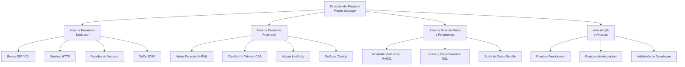
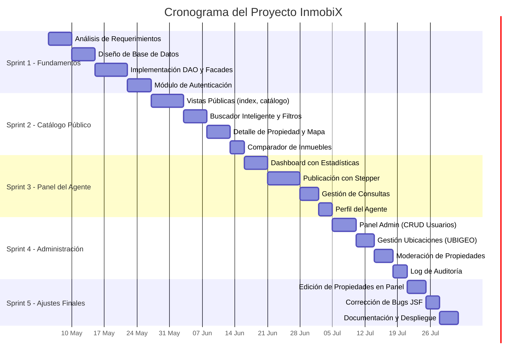
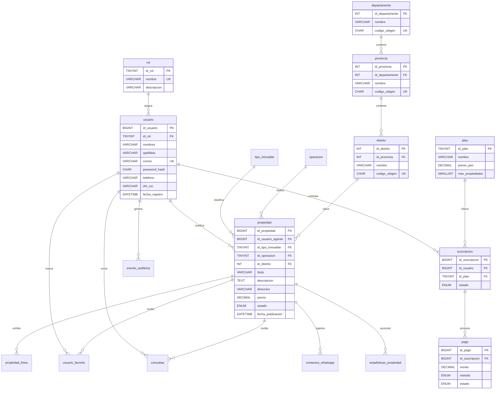
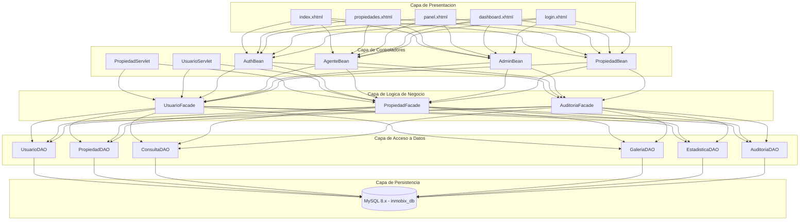
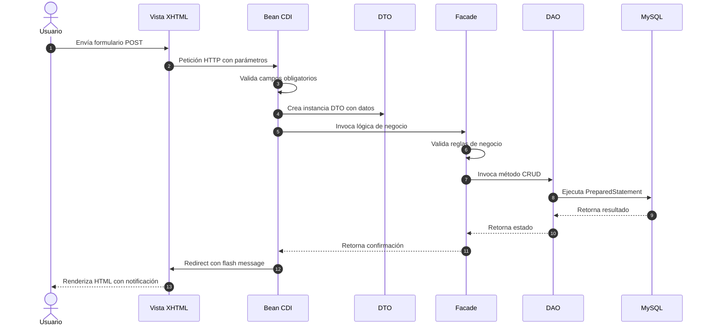

# Documentación Final — Proyecto Web

## InmobiX: Portal Inmobiliario del Perú

**Institución:** Universidad Tecnologica del Peru  
**Experiencia Curricular:** Desarrollo de Aplicaciones Web  
**Ciclo Académico:** 2026-I  
**Fecha de Entrega:** Julio 2026

---

## Índice

- [Introducción](#introducción)
- [1. Capítulo I: Aspectos de la Organización](#1-capítulo-i-aspectos-de-la-organización)
  - [1.1 Visión](#11-visión)
  - [1.2 Misión](#12-misión)
  - [1.3 Reseña Histórica](#13-reseña-histórica)
  - [1.4 Organigrama](#14-organigrama)
  - [1.5 Ámbito del Proyecto](#15-ámbito-del-proyecto)
  - [1.6 Descripción de Funciones y Procesos del Negocio](#16-descripción-de-funciones-y-procesos-del-negocio)
- [2. Capítulo II: Aspectos del Proyecto](#2-capítulo-ii-aspectos-del-proyecto)
  - [2.1 Análisis Situacional](#21-análisis-situacional)
  - [2.2 Formulación del Problema](#22-formulación-del-problema)
  - [2.3 Objetivo del Proyecto](#23-objetivo-del-proyecto)
  - [2.4 Fundamentación Teórica](#24-fundamentación-teórica)
- [3. Capítulo III: Método de Desarrollo del Producto Observable](#3-capítulo-iii-método-de-desarrollo-del-producto-observable)
  - [3.1 Análisis de Requerimiento](#31-análisis-de-requerimiento)
  - [3.2 Diseño](#32-diseño)
  - [3.3 Desarrollo](#33-desarrollo)
  - [3.4 Pruebas](#34-pruebas)
- [4. Capítulo IV: Resultados](#4-capítulo-iv-resultados)
- [5. Capítulo V: Conclusiones](#5-capítulo-v-conclusiones)
- [6. Capítulo VI: Recomendaciones](#6-capítulo-vi-recomendaciones)
- [7. Referencias Bibliográficas](#7-referencias-bibliográficas)
- [8. Anexo](#8-anexo)

---

## Introducción

El presente documento constituye la documentación técnica y funcional del proyecto web denominado **InmobiX — Portal Inmobiliario del Perú**, desarrollado como producto observable de la experiencia curricular de Desarrollo de Aplicaciones Web. El sistema ha sido concebido como una plataforma integral que facilita la publicación, búsqueda, comparación y gestión de inmuebles dentro del mercado inmobiliario peruano, atendiendo las necesidades reales de agentes inmobiliarios, compradores potenciales y administradores de la plataforma.

La solución implementa una arquitectura empresarial basada en el patrón Modelo-Vista-Controlador (MVC) por capas, haciendo uso de tecnologías del ecosistema Jakarta EE 10 sobre un servidor Apache Tomcat 10.x, con persistencia en base de datos MySQL 8.x. El desarrollo ha seguido una metodología iterativa e incremental organizada en sprints, lo cual ha permitido la entrega progresiva de funcionalidades y la incorporación oportuna de ajustes a partir de la retroalimentación continua.

A lo largo de este documento se detallan los aspectos organizacionales del contexto en el que se inscribe el proyecto, la formulación del problema que motivó su desarrollo, los objetivos trazados, la fundamentación teórica que sustenta las decisiones tecnológicas adoptadas, el método de desarrollo aplicado en cada una de sus fases, los resultados obtenidos, las conclusiones derivadas del proceso y las recomendaciones orientadas a la evolución futura del sistema.

---

## 1. Capítulo I: Aspectos de la Organización

### 1.1 Visión

Consolidarse como la plataforma tecnológica de referencia para el sector inmobiliario peruano, proporcionando herramientas digitales innovadoras que simplifiquen la interacción entre ofertantes y demandantes de bienes raíces, impulsando la transparencia, la eficiencia y la confianza en cada transacción inmobiliaria del país.

### 1.2 Misión

Desarrollar y mantener una plataforma web accesible, segura y de alto rendimiento que permita a los agentes inmobiliarios publicar y gestionar sus propiedades de forma eficiente, y a los compradores e interesados encontrar, comparar y contactar respecto a los inmuebles que se ajusten a sus necesidades, todo ello mediante una experiencia de usuario intuitiva y un sistema técnicamente robusto.

### 1.3 Reseña Histórica

El proyecto InmobiX nace como respuesta a una necesidad identificada dentro del ámbito académico de la experiencia curricular de Desarrollo de Aplicaciones Web, durante el ciclo 2026-I. La propuesta surgió a partir del análisis del mercado inmobiliario peruano, en el cual se observó que gran parte de las inmobiliarias y agentes independientes aún dependen de procesos manuales, redes sociales informales o plataformas extranjeras que no contemplan las particularidades del contexto local, tales como la conversión bimonetaria Soles/Dólares, la verificación de partidas registrales SUNARP, los bonos gubernamentales MiVivienda y Bono Verde, y la geolocalización basada en la codificación UBIGEO del INEI.

El desarrollo del sistema se inició en las primeras semanas del ciclo académico con la definición de los requerimientos funcionales y no funcionales, seguida del diseño de la base de datos relacional y la implementación progresiva de los módulos del sistema en sprints sucesivos, hasta alcanzar el producto funcional y desplegable que se presenta en este documento.

### 1.4 Organigrama

El siguiente diagrama representa la estructura organizacional del equipo responsable del proyecto y las áreas funcionales del sistema.



### 1.5 Ámbito del Proyecto

#### 1.5.1 Área donde se va a aplicar el Proyecto

El proyecto se aplica en el dominio del sector inmobiliario, específicamente en la digitalización de los procesos de publicación, búsqueda y gestión de propiedades inmuebles. El sistema está orientado al mercado peruano e integra catálogos geográficos basados en la codificación UBIGEO del Instituto Nacional de Estadística e Informática (INEI), soporte bimonetario PEN/USD con tipo de cambio referencial de la SBS, y compatibilidad con los programas gubernamentales de vivienda (Bono MiVivienda y Bono Verde).

#### 1.5.2 Recursos Humanos necesarios para el Proyecto

| Rol | Responsabilidad Principal |
| :--- | :--- |
| Project Manager | Planificación, seguimiento del cronograma y coordinación del equipo de desarrollo. |
| Desarrollador Back-end | Implementación de la lógica de negocio, servicios REST, Facades y DAOs en Java 17 / Jakarta EE 10. |
| Desarrollador Front-end | Diseño e implementación de las interfaces de usuario con Facelets (XHTML), Tailwind CSS, Leaflet.js y Chart.js. |
| Administrador de Base de Datos | Modelado relacional, creación de scripts DDL/DML, vistas SQL y optimización de consultas en MySQL 8.x. |
| Analista de QA | Ejecución de pruebas funcionales, de integración y de aceptación sobre el sistema desplegado. |

#### 1.5.3 Software necesario para el Proyecto

| Componente | Tecnología / Versión |
| :--- | :--- |
| Lenguaje de programación | Java 17 (LTS) |
| Especificación empresarial | Jakarta EE 10 |
| Framework de vistas | Jakarta Faces (JSF) 4.0 — Implementación Glassfish Mojarra 4.0.5 |
| Contenedor de Inyección de Dependencias (CDI) | Weld Servlet Core 6.0.3.Final |
| API REST | Jersey 4.0.0 (JAX-RS) con Jackson para serialización JSON |
| Servidor de aplicaciones | Apache Tomcat 10.1.x |
| Base de datos | MySQL 8.x |
| Conector JDBC | MySQL Connector/J 8.3.0 |
| Cifrado de contraseñas | jBCrypt 0.4 |
| Herramienta de construcción | Apache Maven 3.x (Maven Wrapper incluido) |
| Control de versiones | Git + GitHub |
| IDE de desarrollo | IntelliJ IDEA / Visual Studio Code |
| Estilos CSS | Tailwind CSS (via CDN) |
| Mapas interactivos | Leaflet.js + MapTiler + OpenStreetMap |
| Gráficos estadísticos | Chart.js |

#### 1.5.4 Hardware necesario para el Proyecto

| Componente | Especificación Mínima |
| :--- | :--- |
| Procesador | Intel Core i5 de 8.ª generación o equivalente AMD Ryzen 5 |
| Memoria RAM | 8 GB DDR4 |
| Almacenamiento | 256 GB SSD |
| Conectividad | Conexión a Internet de 10 Mbps (para CDN de Tailwind CSS, MapTiler y dependencias Maven) |
| Sistema Operativo | Windows 10/11 de 64 bits, macOS 12+ o distribución Linux reciente |
| Navegador | Google Chrome 110+, Mozilla Firefox 110+ o Microsoft Edge 110+ |

#### 1.5.5 Cronograma de Actividades

El desarrollo del proyecto se organizó en cinco sprints con entregas incrementales. El siguiente diagrama de Gantt detalla la distribución temporal de las actividades principales.



### 1.6 Descripción de Funciones y Procesos del Negocio

El sistema InmobiX opera como intermediario digital entre tres actores principales: el visitante o comprador, el agente inmobiliario y el administrador de la plataforma. El proceso de negocio central se articula en torno al ciclo de vida de una publicación inmobiliaria.

El agente inmobiliario inicia sesión en su portal personalizado, donde puede crear una nueva publicación proporcionando los datos generales del inmueble (tipo, operación, título y descripción), la ubicación georreferenciada mediante un selector de mapas interactivo, las características técnicas (área, habitaciones, baños, cocheras), el precio en la moneda de su elección (soles peruanos o dólares americanos) y las fotografías del inmueble. El sistema valida automáticamente las reglas de negocio establecidas, tales como el precio mínimo según el tipo de operación, la obligatoriedad de campos críticos y el límite de publicaciones activas de acuerdo con el plan de suscripción contratado.

Una vez publicada, la propiedad se integra al catálogo público, donde los visitantes y compradores registrados pueden explorar el inventario de inmuebles mediante un buscador inteligente con autocompletado de distritos, filtros avanzados por precio, tipo de inmueble, operación, número de dormitorios y baños, y un comparador que permite contrastar hasta tres propiedades simultáneamente en una tabla de especificaciones técnicas. Los interesados pueden enviar consultas directas al agente o contactarlo vía WhatsApp.

El administrador de la plataforma supervisa la operación del sistema a través de un panel de control que ofrece gestión de usuarios y roles, moderación de propiedades publicadas, administración del catálogo geográfico de ubicaciones (departamentos, provincias y distritos) y un registro de auditoría que traza las acciones críticas realizadas en el sistema.

---

## 2. Capítulo II: Aspectos del Proyecto

### 2.1 Análisis Situacional

El mercado inmobiliario peruano ha experimentado un crecimiento sostenido en los últimos años, impulsado por políticas gubernamentales de acceso a la vivienda como el programa Techo Propio, el Bono MiVivienda y el Bono Verde. Sin embargo, la digitalización de los procesos de comercialización inmobiliaria presenta un avance desigual. Mientras que las grandes empresas del sector cuentan con plataformas tecnológicas robustas, los agentes independientes y las pequeñas inmobiliarias carecen de herramientas accesibles que les permitan competir en igualdad de condiciones.

Las plataformas internacionales existentes no abordan aspectos específicos del contexto peruano, tales como la conversión bimonetaria PEN/USD con tipo de cambio referencial de la SBS/SUNAT, la verificación de partidas registrales SUNARP, la codificación geográfica UBIGEO del INEI para la segmentación por departamento, provincia y distrito, ni la integración con los programas de bonos gubernamentales vigentes.

Esta brecha representa una oportunidad para desarrollar una plataforma web que integre de forma nativa las particularidades del mercado inmobiliario peruano, ofreciendo a todos los actores del sector una herramienta unificada, accesible y profesional.

### 2.2 Formulación del Problema

#### 2.2.1 Problema General

¿De qué manera se puede desarrollar una plataforma web integral que facilite la publicación, búsqueda, comparación y gestión de inmuebles en el mercado peruano, integrando las particularidades locales del sector inmobiliario y proporcionando una experiencia de usuario eficiente tanto para agentes inmobiliarios como para compradores potenciales?

#### 2.2.2 Problemas Específicos

**PE1.** ¿Cómo estructurar una arquitectura de software que garantice la separación de responsabilidades entre la capa de presentación, la lógica de negocio y el acceso a datos, asegurando la mantenibilidad y escalabilidad del sistema?

**PE2.** ¿Qué mecanismos de validación de reglas de negocio se deben implementar en la capa de servicios para garantizar la consistencia e integridad de los datos de propiedades publicadas en la plataforma?

**PE3.** ¿Cómo implementar un sistema de autenticación y autorización basado en roles que proteja los recursos del sistema y delimite las funcionalidades accesibles para cada tipo de usuario?

**PE4.** ¿De qué forma se puede integrar un buscador inteligente con filtros avanzados, geolocalización interactiva y conversión bimonetaria que permita a los compradores encontrar inmuebles de manera eficiente?

**PE5.** ¿Qué estrategia de diseño de interfaz de usuario se debe adoptar para proporcionar una experiencia intuitiva, responsiva y visualmente atractiva que maximice la satisfacción del usuario final?

### 2.3 Objetivo del Proyecto

#### 2.3.1 Objetivo General

Desarrollar una plataforma web funcional, segura y escalable para la gestión integral del proceso inmobiliario en el mercado peruano, implementando una arquitectura MVC por capas con tecnologías del ecosistema Jakarta EE 10, que permita la publicación, búsqueda, comparación y administración de propiedades inmuebles con soporte bimonetario, geolocalización interactiva y control de acceso basado en roles.

#### 2.3.2 Objetivos Específicos

**OE1.** Diseñar e implementar una arquitectura de software basada en el patrón MVC con separación estricta en capas (Presentación, Controlador, Fachada de Negocio, Acceso a Datos y Transferencia de Datos) que garantice la cohesión modular, el bajo acoplamiento entre componentes y la facilidad de mantenimiento del sistema.

**OE2.** Implementar un conjunto de reglas de validación de negocio en la capa de fachada que aseguren la integridad de los datos antes de su persistencia, incluyendo validaciones de precios mínimos por tipo de operación, obligatoriedad de campos críticos, formato de correo electrónico y control del límite de publicaciones por agente según su plan de suscripción.

**OE3.** Desarrollar un sistema de autenticación basado en sesiones de servidor con cifrado de contraseñas mediante el algoritmo BCrypt, complementado por un mecanismo de autorización que restrinja el acceso a los módulos del sistema según el rol asignado al usuario (Visitante, Comprador, Agente, Constructora, Administrador).

**OE4.** Construir un catálogo público con buscador inteligente, filtros avanzados multidimensionales, un módulo de geolocalización interactiva con mapas Leaflet.js, soporte de conversión bimonetaria PEN/USD mediante vista SQL con tipo de cambio de la SBS, y un comparador que permita contrastar propiedades lado a lado.

**OE5.** Diseñar interfaces de usuario responsivas y visualmente profesionales utilizando Facelets (XHTML) como motor de plantillas de JSF 4.0, estilizadas con Tailwind CSS, e integrar componentes interactivos como gráficos estadísticos con Chart.js y selectores de geolocalización con Leaflet.js para enriquecer la experiencia del usuario final.

### 2.4 Fundamentación Teórica

**Full Stack Development.** El desarrollo full stack comprende la implementación tanto de la capa de presentación visible al usuario (front-end) como de la lógica de procesamiento del lado del servidor (back-end). En el contexto de este proyecto, el enfoque full stack se materializa mediante el uso de Jakarta Faces (JSF) 4.0 con Facelets para las vistas, CDI Beans y Servlets HTTP como controladores, y un conjunto de Facades, DAOs y DTOs para la lógica de negocio y persistencia, todo ello ejecutándose sobre un servidor Apache Tomcat 10.x con Java 17.

**Front-end.** El front-end es la capa del sistema con la cual el usuario interactúa directamente. En este proyecto, las vistas están construidas con Facelets (archivos `.xhtml`), el estándar de plantillas de JSF 4.0, que permite la composición modular de interfaces mediante plantillas reutilizables (`ui:composition`, `ui:define`). La estilización se realiza con Tailwind CSS, un framework de utilidades CSS que permite construir interfaces modernas y responsivas. Se integran además componentes interactivos de terceros: Leaflet.js para la renderización de mapas geográficos interactivos con capa de tiles de OpenStreetMap, y Chart.js para la generación dinámica de gráficos estadísticos en el panel del agente.

**Back-end.** El back-end constituye el núcleo del procesamiento del sistema. Está implementado en Java 17 bajo la especificación Jakarta EE 10 y se despliega como una aplicación WAR en Apache Tomcat 10.x. La lógica del servidor se organiza en capas bien definidas: los Beans CDI (`@Named`, `@SessionScoped`, `@RequestScoped`) gestionan el estado de la aplicación y la interacción con las vistas JSF; los Servlets HTTP procesan las peticiones REST; las Facades encapsulan las reglas de negocio; y los DAOs ejecutan las operaciones de persistencia mediante sentencias SQL parametrizadas con `PreparedStatement`.

**API REST.** El sistema expone un conjunto de endpoints RESTful implementados con Servlets HTTP estándar de Jakarta EE, que permiten la comunicación asíncrona entre el front-end y el back-end para operaciones como la búsqueda de propiedades, la gestión de favoritos, el envío de consultas y la administración de usuarios. Los datos se intercambian en formato JSON serializado mediante la biblioteca Jackson.

**Base de Datos Relacional.** La persistencia del sistema se sustenta en un modelo relacional implementado en MySQL 8.x, que consta de diecisiete tablas interrelacionadas mediante claves foráneas con integridad referencial. El esquema incluye tablas para la geografía peruana (departamento, provincia, distrito basadas en UBIGEO-INEI), usuarios y roles, catálogos de propiedades, multimedia y galería, interacciones (consultas y contactos WhatsApp), planes y suscripciones, pagos, estadísticas de vistas y un log de auditoría. Se implementa además una vista SQL denominada `v_propiedades_bimonetarias` que calcula automáticamente los precios en ambas monedas (PEN y USD) utilizando el tipo de cambio vigente de la SBS.

**Despliegue.** El proceso de despliegue se gestiona mediante Apache Maven, que compila el código fuente Java 17, empaqueta los recursos en un archivo WAR (`ROOT.war`) y lo despliega en un servidor Apache Tomcat 10.x. El proyecto incluye un Maven Wrapper (`mvnw.cmd`) que garantiza la portabilidad del entorno de construcción sin requerir la instalación previa de Maven. El plugin Cargo permite la descarga e inicialización automática de Tomcat para pruebas locales.

**Seguridad.** La seguridad del sistema se implementa en múltiples niveles. Las contraseñas de los usuarios se almacenan cifradas mediante el algoritmo BCrypt (jBCrypt 0.4), que incorpora un factor de sal aleatorio (salt) que dificulta ataques de fuerza bruta y tablas rainbow. La autenticación se gestiona mediante sesiones de servidor con el objeto `UsuarioDTO` almacenado en el `SessionMap` del `ExternalContext` de JSF. Las consultas a la base de datos utilizan exclusivamente sentencias parametrizadas (`PreparedStatement`), lo cual previene vulnerabilidades de inyección SQL. El control de acceso basado en roles restringe la visibilidad de los módulos del sistema según el nivel de autorización del usuario autenticado.

---

## 3. Capítulo III: Método de Desarrollo del Producto Observable

El desarrollo del sistema InmobiX se realizó siguiendo una metodología ágil iterativa e incremental, organizada en cinco sprints con entregas funcionales al final de cada iteración. Esta aproximación permitió incorporar retroalimentación continua, priorizar funcionalidades de alto valor y gestionar el riesgo de forma progresiva.

### 3.1 Análisis de Requerimiento

#### Requerimientos Funcionales

| Código | Descripción | Prioridad |
| :--- | :--- | :---: |
| RF-01 | El sistema debe permitir el registro de usuarios con asignación de roles (Visitante, Comprador, Agente, Constructora, Administrador). | Alta |
| RF-02 | El sistema debe permitir el inicio de sesión con validación de credenciales y cifrado BCrypt. | Alta |
| RF-03 | El sistema debe permitir a los agentes publicar propiedades con datos generales, ubicación georreferenciada, características técnicas, precio y fotografías. | Alta |
| RF-04 | El sistema debe proporcionar un catálogo público con buscador inteligente, filtros avanzados y paginación. | Alta |
| RF-05 | El sistema debe mostrar el detalle completo de cada propiedad, incluyendo galería de fotos, mapa interactivo y datos del agente. | Alta |
| RF-06 | El sistema debe permitir la comparación lado a lado de hasta tres propiedades. | Media |
| RF-07 | El sistema debe permitir a los compradores guardar propiedades como favoritas. | Media |
| RF-08 | El sistema debe permitir el envío de consultas por propiedad y la gestión de estas por el agente. | Alta |
| RF-09 | El sistema debe proporcionar un panel de administración con gestión de usuarios, propiedades, ubicaciones y auditoría. | Alta |
| RF-10 | El sistema debe implementar un flujo de edición directa de propiedades dentro del panel del agente. | Media |
| RF-11 | El sistema debe presentar estadísticas de visitas por propiedad mediante gráficos interactivos. | Media |
| RF-12 | El sistema debe soportar la conversión bimonetaria PEN/USD con tipo de cambio referencial de la SBS. | Alta |

#### Requerimientos No Funcionales

| Código | Descripción | Categoría |
| :--- | :--- | :---: |
| RNF-01 | Las contraseñas deben almacenarse cifradas con BCrypt. | Seguridad |
| RNF-02 | Todas las consultas SQL deben utilizar sentencias parametrizadas (PreparedStatement). | Seguridad |
| RNF-03 | La interfaz debe ser responsiva y compatible con navegadores modernos (Chrome 110+, Firefox 110+, Edge 110+). | Usabilidad |
| RNF-04 | El sistema debe construirse y empaquetarse mediante Apache Maven como archivo WAR desplegable. | Portabilidad |
| RNF-05 | El tiempo de respuesta de las páginas principales no debe exceder los 3 segundos en condiciones normales. | Rendimiento |
| RNF-06 | El código debe seguir el patrón MVC con separación estricta por capas. | Mantenibilidad |

### 3.2 Diseño

#### Modelo Entidad-Relación

El siguiente diagrama representa el modelo relacional de la base de datos del sistema, compuesto por diecisiete tablas organizadas en bloques funcionales.



#### Arquitectura de Capas del Sistema

El siguiente diagrama ilustra la arquitectura por capas implementada, desde la interacción del usuario hasta la persistencia en base de datos.



#### Flujo de una Operación MVC

El siguiente diagrama de secuencia ilustra el recorrido completo de una petición desde que el usuario envía un formulario hasta que recibe la respuesta renderizada.



### 3.3 Desarrollo

El desarrollo del sistema se ejecutó en cinco sprints, cada uno con entregables funcionales verificables.

**Sprint 1 — Fundamentos y Persistencia.** Se diseñó e implementó el modelo relacional de la base de datos con diecisiete tablas, incluyendo claves foráneas, índices de rendimiento y la vista `v_propiedades_bimonetarias`. Se desarrollaron las clases DAO con acceso JDBC parametrizado, las Facades con validaciones de negocio, los DTOs para transferencia de datos entre capas, y la clase utilitaria `ConexionDB` para la gestión centralizada de conexiones. Se implementó el módulo de autenticación con cifrado BCrypt y gestión de sesiones mediante el bean CDI `AuthBean`.

**Sprint 2 — Catálogo Público e Interactividad.** Se construyeron las vistas públicas del sistema: la página de inicio con buscador inteligente y autocompletado, el catálogo de propiedades con filtros avanzados y paginación, el detalle de propiedad con galería de fotos y mapa interactivo Leaflet.js, y el comparador de inmuebles. Se integraron los componentes de interfaz con Tailwind CSS y se configuraron las plantillas Facelets reutilizables.

**Sprint 3 — Portal del Agente Inmobiliario.** Se desarrolló el panel del agente con dashboard de estadísticas mediante gráficos Chart.js, el formulario de publicación de propiedades guiado por un stepper interactivo de cinco pasos con validación progresiva, el módulo de gestión de consultas recibidas con cambio de estado, y el formulario de actualización del perfil personal del agente con sincronización en sesión y base de datos.

**Sprint 4 — Panel de Administración.** Se implementó el módulo de administración con gestión CRUD de usuarios y roles, moderación de propiedades publicadas con cambio de estado, administración del catálogo geográfico UBIGEO (departamentos, provincias y distritos), y el visor de log de auditoría con filtros por entidad, acción y rango de fechas.

**Sprint 5 — Ajustes Finales y Calidad.** Se implementó el formulario de edición directa de propiedades dentro del panel del agente (sin stepper, en una sola página), se resolvieron defectos identificados en el ciclo de vida JSF relacionados con la preservación del estado en beans de alcance de petición, se optimizó la validación multicapa (cliente y servidor) y se elaboró la documentación técnica y funcional del proyecto.

### 3.4 Pruebas

Las pruebas del sistema se ejecutaron en tres niveles complementarios.

**Pruebas Unitarias de Validación de Negocio.** Se verificó de forma aislada el correcto funcionamiento de los métodos de validación implementados en las clases `UsuarioFacade` y `PropiedadFacade`, confirmando que las reglas de negocio (precio mínimo por operación, obligatoriedad de campos, formato de correo, longitud mínima de contraseña, restricción de estados válidos) se aplican correctamente y generan los mensajes de error esperados.

**Pruebas de Integración.** Se verificó la interacción completa entre las capas del sistema, desde el envío de formularios en las vistas Facelets, pasando por el procesamiento en los beans CDI, la validación en las facades, la persistencia mediante los DAOs, hasta la confirmación de que los datos se almacenan correctamente en la base de datos MySQL y se reflejan en las vistas subsiguientes.

**Pruebas Funcionales de Aceptación.** Se ejecutaron escenarios completos de uso que abarcan los flujos críticos del sistema: registro e inicio de sesión de usuarios con diferentes roles, publicación y edición de propiedades por parte de agentes, búsqueda y filtrado de inmuebles por parte de compradores, envío y gestión de consultas, gestión administrativa de usuarios y propiedades, y verificación del comportamiento correcto del control de acceso basado en roles.

---

## 4. Capítulo IV: Resultados

El desarrollo del proyecto InmobiX ha producido una plataforma web funcional, desplegable y lista para demostración, que cumple con la totalidad de los requerimientos funcionales y no funcionales establecidos en la fase de análisis. A continuación se presentan los resultados alcanzados organizados por módulo.

**Módulo de Autenticación y Registro.** El sistema permite el registro de nuevos usuarios con asignación automática de roles y validación de datos obligatorios. El inicio de sesión verifica las credenciales contra contraseñas cifradas con BCrypt almacenadas en la base de datos. Según el rol del usuario autenticado, el sistema redirige automáticamente al módulo correspondiente: catálogo público para compradores, portal del agente para agentes e inmobiliarias, y panel de administración para administradores.

**Catálogo Público de Propiedades.** El catálogo presenta las propiedades activas con soporte de búsqueda inteligente por texto libre con autocompletado de distritos, filtros combinados por tipo de operación (venta, alquiler, anticresis), tipo de inmueble (casa, departamento, terreno, local, oficina), rango de precio, número de dormitorios y baños. Los resultados se presentan paginados con precios convertidos automáticamente a ambas monedas (PEN y USD) mediante la vista SQL `v_propiedades_bimonetarias`.

**Detalle de Propiedad con Geolocalización.** La vista de detalle presenta la información completa del inmueble con galería de fotografías, mapa interactivo con marcador georreferenciado, datos técnicos estructurados, precio bimonetario, información del agente responsable y formulario de contacto integrado. El sistema registra automáticamente las vistas diarias para las estadísticas del agente.

**Portal del Agente Inmobiliario.** El portal ofrece un dashboard personalizado con indicadores clave (propiedades activas, consultas pendientes, contactos WhatsApp semanales) y gráficos de visitas por propiedad generados con Chart.js. El formulario de publicación guiado mediante un stepper de cinco pasos con validación progresiva garantiza la calidad de los datos ingresados. La edición de propiedades existentes se realiza mediante un formulario unificado a pantalla completa dentro del mismo panel, con selector de mapa interactivo y gestión dinámica de la galería fotográfica. El módulo de consultas permite al agente visualizar y gestionar las solicitudes recibidas con cambio de estado (Pendiente, Leída, Respondida, No Interesado).

**Panel de Administración.** El panel proporciona gestión CRUD completa de usuarios con asignación de roles, moderación de propiedades con cambio de estado, administración jerárquica del catálogo geográfico UBIGEO y un visor de eventos de auditoría con filtros temporales y por tipo de acción.

**Calidad y Rendimiento.** El sistema compila y empaqueta correctamente mediante Maven (`BUILD SUCCESS`), genera un archivo WAR desplegable en cualquier contenedor Jakarta EE compatible, y opera de forma estable bajo las condiciones de prueba establecidas.

---

## 5. Capítulo V: Conclusiones

**Primera.** Se logró diseñar e implementar una arquitectura MVC por capas con separación estricta de responsabilidades, donde la capa de presentación (Facelets XHTML), los controladores (Beans CDI y Servlets), las facades de negocio, los DAOs de persistencia y los DTOs de transferencia operan de forma cohesiva y desacoplada. Esta organización facilita el mantenimiento, la extensibilidad y la incorporación de nuevas funcionalidades sin afectar los módulos existentes.

**Segunda.** La implementación de validaciones de negocio en la capa de fachada demostró ser una estrategia efectiva para garantizar la integridad de los datos antes de su persistencia. Las reglas de precio mínimo por operación, obligatoriedad de campos y control de límite de publicaciones se aplican de forma consistente tanto en la creación como en la actualización de propiedades, asegurando la calidad del catálogo publicado.

**Tercera.** El sistema de autenticación basado en sesiones de servidor con cifrado BCrypt y el control de acceso basado en roles proporcionan un nivel de seguridad adecuado para una aplicación web del segmento inmobiliario. La utilización exclusiva de sentencias parametrizadas en las consultas SQL previene vulnerabilidades de inyección, mientras que el cifrado de contraseñas protege las credenciales almacenadas contra accesos no autorizados.

**Cuarta.** La integración de componentes interactivos de terceros (Leaflet.js para mapas, Chart.js para gráficos y Tailwind CSS para estilos) con el ciclo de vida de JSF 4.0 demostró ser viable y productiva, permitiendo la construcción de interfaces modernas y funcionales que enriquecen significativamente la experiencia del usuario en comparación con aproximaciones puramente tradicionales de renderizado del lado del servidor.

**Quinta.** La metodología iterativa e incremental aplicada en el desarrollo del proyecto permitió gestionar la complejidad del sistema de forma progresiva, priorizando las funcionalidades de mayor impacto y facilitando la incorporación de ajustes derivados de la retroalimentación obtenida en cada sprint.

---

## 6. Capítulo VI: Recomendaciones

**Primera.** Se recomienda implementar un filtro de servlet (`jakarta.servlet.Filter`) a nivel del contenedor que intercepte todas las peticiones dirigidas a las rutas protegidas (`/agente/*` y `/admin/*`) y redirija automáticamente a la página de inicio de sesión cuando el usuario no se encuentre autenticado. Esta mejora reforzaría la seguridad del sistema frente a intentos de acceso directo por URL.

**Segunda.** Se sugiere incorporar un mecanismo de carga de imágenes basado en almacenamiento en la nube (por ejemplo, Amazon S3 o Google Cloud Storage) en reemplazo del sistema actual basado en rutas locales del servidor. Esta evolución mejoraría la escalabilidad, la disponibilidad y el rendimiento de la entrega de contenido multimedia.

**Tercera.** Se recomienda migrar la gestión de conexiones JDBC desde la clase utilitaria `ConexionDB` con `DriverManager` hacia un pool de conexiones gestionado por el contenedor (por ejemplo, HikariCP o el `DataSource` de Tomcat), lo cual optimizaría significativamente el rendimiento en escenarios de alta concurrencia.

**Cuarta.** Se sugiere incorporar pruebas automatizadas unitarias con JUnit 5 y pruebas de integración con Arquillian o Selenium para establecer una suite de regresión que garantice la estabilidad del sistema ante futuras modificaciones y extensiones del código.

**Quinta.** Se recomienda explorar la integración con pasarelas de pago nacionales (Culqi, Niubiz o Izipay) para habilitar la funcionalidad de suscripciones y pagos de planes premium, cuya estructura de datos ya se encuentra modelada en la base de datos del sistema pero aún no ha sido implementada a nivel de flujo transaccional completo.

**Sexta.** Se sugiere implementar un sistema de notificaciones en tiempo real basado en WebSocket (Jakarta WebSocket) que alerte a los agentes cuando reciban nuevas consultas o contactos por WhatsApp, mejorando la capacidad de respuesta y la satisfacción del cliente final.

---

## 7. Referencias Bibliográficas

**[1]** Oracle Corporation. (2023). *Jakarta EE 10 Specification*. Eclipse Foundation. Recuperado de https://jakarta.ee/specifications/

**[2]** Eclipse Foundation. (2023). *Jakarta Faces 4.0 Specification (JSF)*. Recuperado de https://jakarta.ee/specifications/faces/4.0/

**[3]** Apache Software Foundation. (2024). *Apache Tomcat 10.1 Documentation*. Recuperado de https://tomcat.apache.org/tomcat-10.1-doc/

**[4]** Oracle Corporation. (2023). *MySQL 8.0 Reference Manual*. Recuperado de https://dev.mysql.com/doc/refman/8.0/en/

**[5]** Maven Project. (2024). *Apache Maven Documentation*. Recuperado de https://maven.apache.org/guides/

**[6]** Aggarwal, V. (2019). *Leaflet.js Essentials*. Packt Publishing. Documentación oficial disponible en https://leafletjs.com/reference.html

**[7]** Chart.js Contributors. (2024). *Chart.js Documentation v4*. Recuperado de https://www.chartjs.org/docs/latest/

**[8]** Tailwind Labs. (2024). *Tailwind CSS Documentation*. Recuperado de https://tailwindcss.com/docs

**[9]** OWASP Foundation. (2023). *OWASP Top Ten Web Application Security Risks*. Recuperado de https://owasp.org/www-project-top-ten/

**[10]** Instituto Nacional de Estadística e Informática – INEI. (2023). *Código de Ubicación Geográfica (UBIGEO)*. Recuperado de https://www.inei.gob.pe/

**[11]** Superintendencia de Banca, Seguros y AFP – SBS. (2024). *Tipo de Cambio*. Recuperado de https://www.sbs.gob.pe/app/pp/EstadisticasSAEEPortal/Paginas/TIActivaTipoCreditoEmpresa.aspx

---

## 8. Anexo

### Anexo A: Estructura Completa de Directorios del Proyecto

```text
Portal-Inmobiliario-master/
├── src/main/java/org/example/proyectoweb/
│   ├── bean/                          # Managed Beans CDI (JSF)
│   │   ├── AdminBean.java             # Controlador del panel de administración
│   │   ├── AgenteBean.java            # Controlador del portal del agente
│   │   ├── AuthBean.java              # Autenticación y gestión de sesión
│   │   ├── ConfiguracionBean.java     # Configuración global de la aplicación
│   │   ├── ConsultaBean.java          # Gestión de consultas
│   │   ├── ContactoBean.java          # Formulario de contacto
│   │   ├── DetallePropiedadBean.java  # Vista de detalle de propiedad
│   │   ├── FavoritoBean.java          # Gestión de favoritos del usuario
│   │   ├── PagoBean.java              # Procesamiento de pagos
│   │   ├── PropiedadBean.java         # Catálogo público de propiedades
│   │   └── UsuarioBean.java           # Perfil de usuario
│   ├── controller/                    # Servlets HTTP (API REST)
│   │   ├── AdminServlet.java          # Endpoints de administración
│   │   ├── AgenteServlet.java         # Endpoints del agente
│   │   ├── AnalyticsServlet.java      # Estadísticas y métricas
│   │   ├── ComparadorServlet.java     # Comparador de inmuebles
│   │   ├── ConsultaServlet.java       # API de consultas
│   │   ├── ContactoServlet.java       # API de contacto
│   │   ├── FavoritoServlet.java       # API de favoritos
│   │   ├── GaleriaServlet.java        # Gestión de galería de fotos
│   │   ├── PagoServlet.java           # API de pagos
│   │   ├── PanelAgenteServlet.java    # API del panel del agente
│   │   ├── PropiedadServlet.java      # API principal de propiedades
│   │   ├── UsuarioServlet.java        # API de usuarios
│   │   └── WhatsAppServlet.java       # Registro de contactos WhatsApp
│   ├── dao/                           # Objetos de Acceso a Datos (JDBC)
│   │   ├── AuditoriaDAO.java          # Log de auditoría
│   │   ├── ConsultaDAO.java           # Consultas por propiedad
│   │   ├── ContactoDAO.java           # Mensajes de contacto
│   │   ├── EstadisticaDAO.java        # Estadísticas de vistas
│   │   ├── FavoritoDAO.java           # Favoritos de usuarios
│   │   ├── GaleriaDAO.java            # Galería de fotos
│   │   ├── PagoDAO.java               # Registro de pagos
│   │   ├── PropiedadDAO.java          # CRUD de propiedades
│   │   ├── UbicacionDAO.java          # Catálogo UBIGEO
│   │   ├── UsuarioDAO.java            # CRUD de usuarios
│   │   └── WhatsAppDAO.java           # Contactos WhatsApp
│   ├── dto/                           # Objetos de Transferencia de Datos
│   │   ├── CatalogoDTO.java           # Catálogos genéricos (tipo, operación)
│   │   ├── ConsultaDTO.java           # Datos de consulta
│   │   ├── ContactoDTO.java           # Datos de contacto
│   │   ├── EstadisticaDiariaDTO.java  # Estadística diaria
│   │   ├── EventoAuditoriaDTO.java    # Evento de auditoría
│   │   ├── PagoDTO.java               # Datos de pago
│   │   ├── PlanDTO.java               # Plan de suscripción
│   │   ├── PropiedadDTO.java          # Datos de propiedad
│   │   ├── PropiedadFotoDTO.java      # Foto de galería
│   │   ├── UbicacionDTO.java          # Ubicación geográfica
│   │   └── UsuarioDTO.java            # Datos de usuario
│   ├── facade/                        # Lógica de Negocio
│   │   ├── AuditoriaFacade.java       # Reglas de auditoría
│   │   ├── ContactoFacade.java        # Reglas de contacto
│   │   ├── FavoritoFacade.java        # Reglas de favoritos
│   │   ├── PropiedadFacade.java       # Reglas de publicación
│   │   ├── UbicacionFacade.java       # Reglas de ubicación
│   │   └── UsuarioFacade.java         # Reglas de usuario
│   └── util/                          # Utilidades
│       ├── ConexionDB.java            # Gestión de conexiones JDBC
│       ├── LocalePhaseListener.java   # Listener de internacionalización
│       └── TestDB.java                # Script de prueba de conexión
├── src/main/webapp/
│   ├── WEB-INF/
│   │   ├── templates/                 # Plantillas Facelets reutilizables
│   │   │   ├── plantilla.xhtml        # Base para vistas públicas
│   │   │   ├── plantilla_admin.xhtml  # Base para panel de administración
│   │   │   ├── plantilla_agente.xhtml # Base para portal del agente
│   │   │   └── plantilla_auth.xhtml   # Base para login y registro
│   │   ├── beans.xml                  # Configuración CDI
│   │   ├── faces-config.xml           # Configuración JSF 4.0
│   │   └── web.xml                    # Descriptor de despliegue
│   ├── admin/                         # Vistas del administrador
│   │   ├── auditoria.xhtml            # Log de auditoría
│   │   ├── dashboard.xhtml            # Dashboard principal
│   │   ├── propiedades.xhtml          # Moderación de propiedades
│   │   ├── ubicaciones.xhtml          # Gestión UBIGEO
│   │   └── usuarios.xhtml            # Gestión de usuarios
│   ├── agente/                        # Vistas del agente
│   │   ├── panel.xhtml                # Portal completo del agente
│   │   └── publicar.xhtml             # Formulario de publicación con stepper
│   ├── usuario/                       # Vistas del comprador
│   │   ├── favoritos.xhtml            # Lista de favoritos
│   │   └── perfil.xhtml               # Perfil personal
│   ├── assets/                        # Recursos estáticos (CSS, JS, imágenes)
│   ├── index.xhtml                    # Página de inicio pública
│   ├── propiedades.xhtml              # Catálogo con filtros
│   ├── detalle_propiedad.xhtml        # Detalle del inmueble
│   ├── login.xhtml                    # Inicio de sesión
│   ├── registro.xhtml                 # Registro de usuario
│   ├── contacto.xhtml                 # Formulario de contacto
│   ├── nosotros.xhtml                 # Página institucional
│   ├── faq.xhtml                      # Preguntas frecuentes
│   └── planes.xhtml                   # Planes de suscripción
├── inmobix_db.sql                     # Script DDL/DML de la base de datos
├── pom.xml                            # Configuración de Maven
└── mvnw.cmd                           # Maven Wrapper (Windows)
```

### Anexo B: Roles y Permisos del Sistema

| Funcionalidad | Visitante | Comprador | Agente | Constructora | Administrador |
| :--- | :---: | :---: | :---: | :---: | :---: |
| Buscar y visualizar propiedades | ✔ | ✔ | ✔ | ✔ | ✔ |
| Ver mapa interactivo y detalle | ✔ | ✔ | ✔ | ✔ | ✔ |
| Comparar inmuebles | ✔ | ✔ | ✔ | ✔ | — |
| Registrarse en la plataforma | ✔ | — | — | — | — |
| Guardar favoritos | — | ✔ | ✔ | ✔ | — |
| Enviar consultas por propiedad | ✔ | ✔ | — | — | — |
| Publicar propiedades | — | — | ✔ | ✔ | ✔ |
| Editar propiedades propias | — | — | ✔ | ✔ | — |
| Ver estadísticas y gráficos | — | — | ✔ | ✔ | — |
| Gestionar consultas recibidas | — | — | ✔ | ✔ | — |
| Contratar planes premium | — | — | ✔ | ✔ | — |
| Gestionar usuarios y roles | — | — | — | — | ✔ |
| Moderar propiedades | — | — | — | — | ✔ |
| Administrar ubicaciones UBIGEO | — | — | — | — | ✔ |
| Consultar log de auditoría | — | — | — | — | ✔ |

### Anexo C: Instrucciones de Compilación y Despliegue

**Prerrequisitos.** Se requiere tener instalado Java JDK 17 o superior, MySQL 8.x en ejecución sobre el puerto 3306, y un navegador web moderno. No se requiere la instalación previa de Apache Maven ni de Apache Tomcat, dado que el proyecto incluye un Maven Wrapper y el plugin Cargo que descarga e inicializa el servidor de forma automática.

**Paso 1 — Preparación de la Base de Datos.** Se debe crear la base de datos ejecutando el script `inmobix_db.sql` incluido en la raíz del proyecto. Este script crea todas las tablas, vistas, índices y datos semilla necesarios para el funcionamiento del sistema.

```sql
mysql -u root -p < inmobix_db.sql
```

**Paso 2 — Configuración de la Conexión.** Se debe verificar que las credenciales de acceso a MySQL configuradas en la clase `ConexionDB.java` coincidan con las del entorno local. La configuración por defecto utiliza el usuario `root` en el puerto 3306 de localhost.

**Paso 3 — Compilación y Empaquetado.** Se ejecuta el siguiente comando desde la raíz del proyecto para compilar el código fuente y generar el archivo WAR desplegable.

```bash
.\mvnw.cmd clean package -DskipTests
```

**Paso 4 — Despliegue Automático con Cargo.** Para iniciar el servidor Tomcat de forma automática con la aplicación desplegada, se ejecuta el siguiente comando.

```bash
.\mvnw.cmd cargo:run -DskipTests
```

**Paso 5 — Acceso al Sistema.** Una vez iniciado el servidor, el sistema es accesible en la dirección `http://localhost:8080/` desde cualquier navegador web.

### Anexo D: Credenciales de Prueba

| Rol | Correo | Contraseña |
| :--- | :--- | :--- |
| Administrador | admin@inmobix.pe | admin123 |
| Agente | carlos.mendoza@inmobix.pe | agente123 |
| Comprador | maria.lopez@gmail.com | comprador123 |

