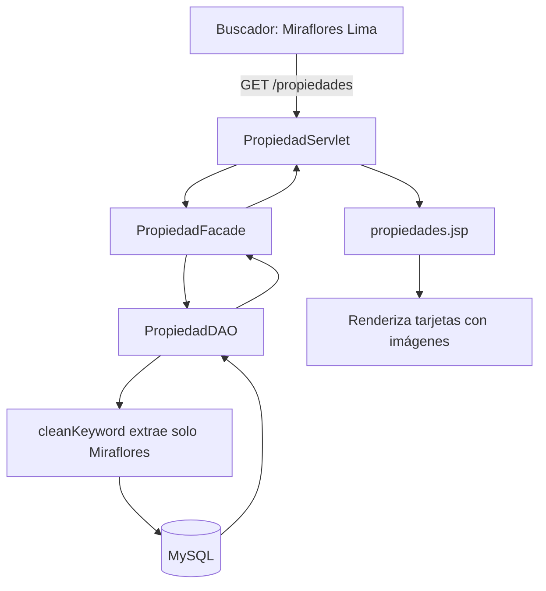

---

## 4. Estructura de Carpetas

```text
Portal-Inmobiliario/
├── src/main/java/org/example/proyectoweb/
│   ├── bean/              # Managed Beans JSF
│   ├── controller/        # Servlets HTTP
│   ├── dao/               # Acceso a datos JDBC
│   ├── dto/               # Objetos de transferencia
│   ├── facade/            # Lógica de negocio
│   └── util/              # ConexionDB y utilidades
├── src/main/webapp/
│   ├── WEB-INF/views/
│   │   ├── admin/         # Panel de administración
│   │   ├── agente/        # Panel y registro del agente
│   │   ├── layout/        # Componente header.jsp
│   │   ├── public/        # Catálogo, detalle, comparador
│   │   └── usuario/       # Favoritos del comprador
│   ├── assets/            # CSS, JS, logos
│   ├── index.jsp          # Página de inicio
│   └── *.xhtml            # Vistas JSF
├── inmobix_db.sql         # Script de base de datos
└── pom.xml                # Dependencias Maven
```

---

## 5. Roles y Permisos

| Funcionalidad | Usuario | Agente | Admin |
| :--- | :---: | :---: | :---: |
| Buscar y ver propiedades | ✔ | ✔ | ✔ |
