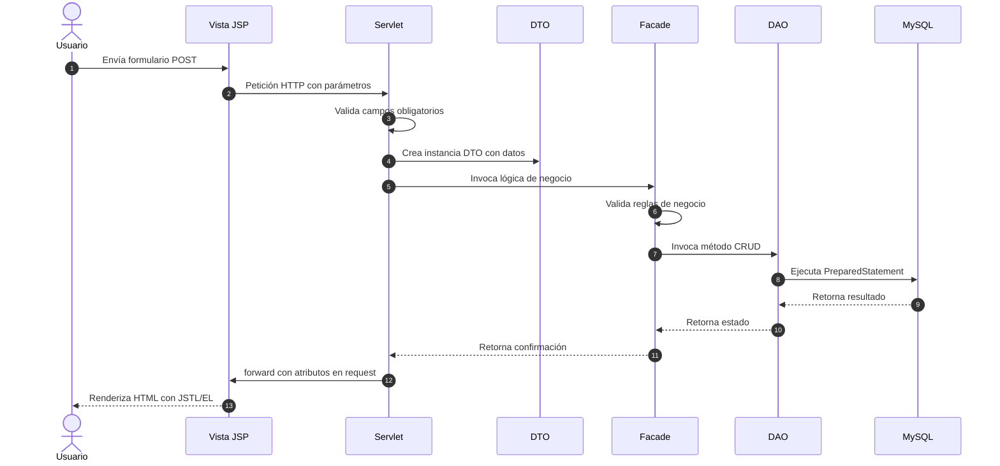
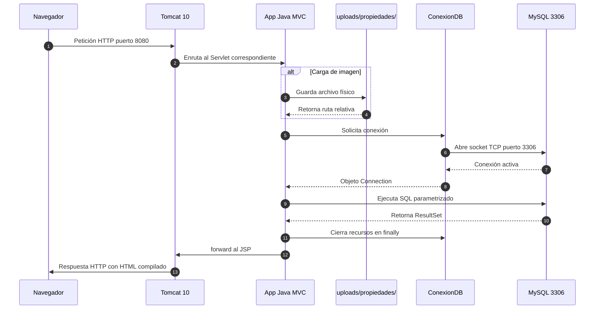
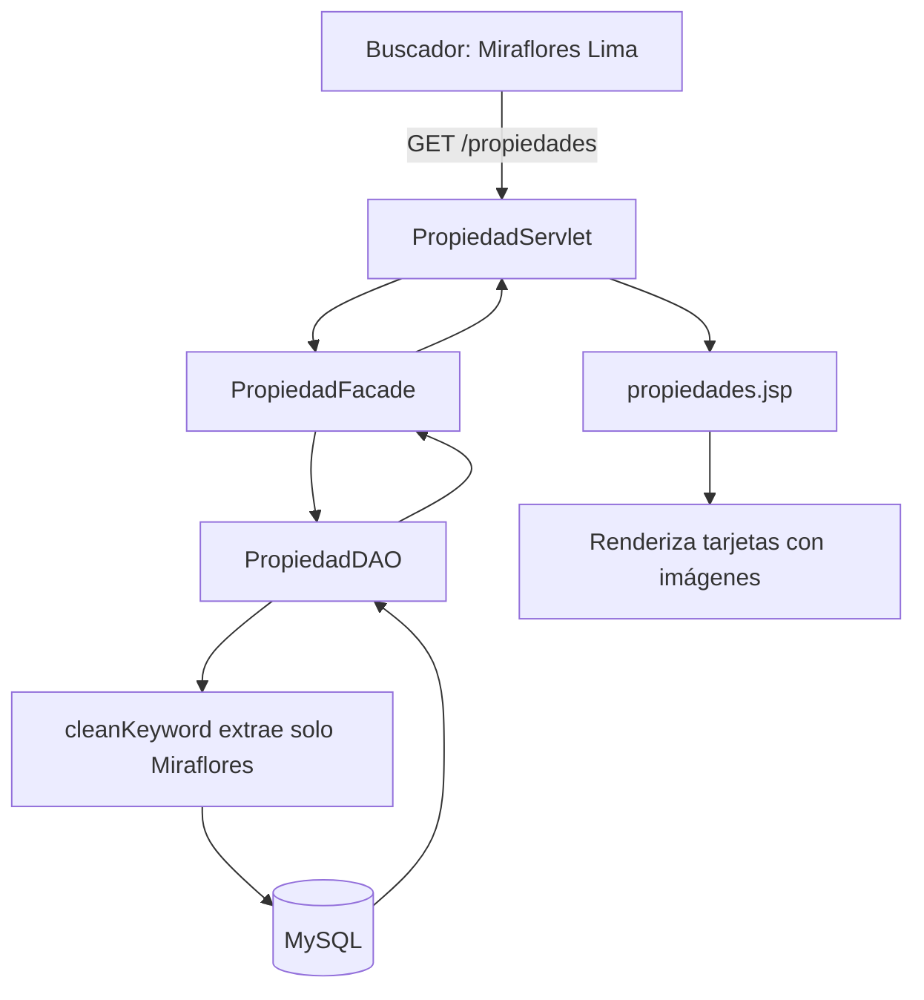
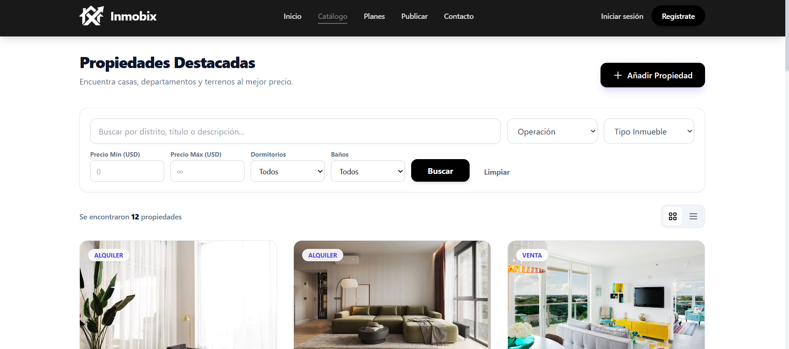
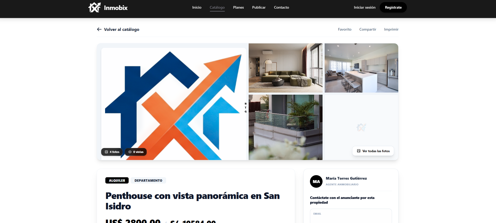
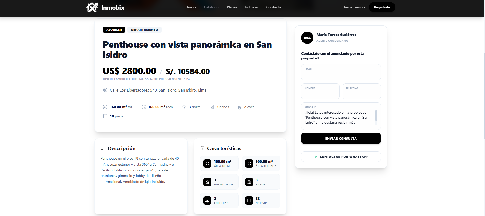
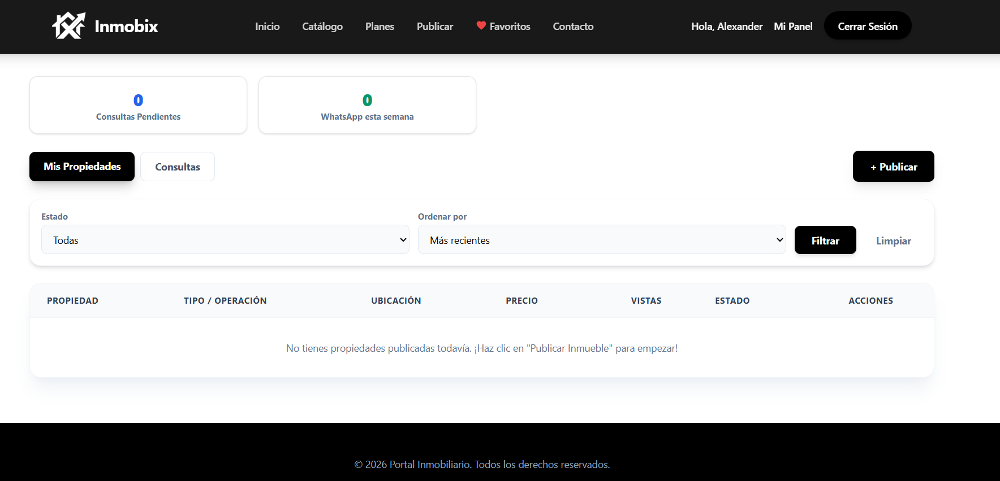

# InmobiX — Portal Inmobiliario
**Proyecto Académico · Arquitectura MVC por Capas · Jakarta EE**

Plataforma web para la publicación, búsqueda y comparación de inmuebles en el mercado peruano. Implementa el patrón MVC con separación estricta de responsabilidades mediante capas desacopladas.

---

## 1. Stack Tecnológico

| Componente | Tecnología |
| :--- | :--- |
| **Lenguaje** | Java 17 + Jakarta EE 10 |
| **Servidor** | Apache Tomcat 10.x |
| **Base de Datos** | MySQL 8.x con JDBC nativo |
| **Vistas** | JSP + JSTL 3.x + Expression Language |
| **Estilos** | Tailwind CSS |
| **Mapas** | Leaflet.js + OpenStreetMap |
| **Gráficos** | Chart.js |
| **Build** | Maven Wrapper |

---

## 2. Arquitectura MVC por Capas

| Capa | Paquete | Función |
| :--- | :--- | :--- |
| **Vista** | webapp/WEB-INF/views/ | Renderiza HTML con JSTL y EL. Sin scriptlets. |
| **Controlador** | controller/ | Servlets que reciben peticiones HTTP y gestionan sesiones. |
| **Fachada** | facade/ | Orquesta DAOs y aplica reglas de negocio. |
| **DAO** | dao/ | Ejecuta consultas SQL con PreparedStatement. |
| **DTO** | dto/ | Objetos planos para transportar datos entre capas. |
| **Utilidades** | util/ | Clase ConexionDB para gestión de conexiones JDBC. |

---

## 3. Diagramas del Sistema

### 3.1 Flujo de una operación MVC

Secuencia completa desde que el usuario envía un formulario hasta que recibe la respuesta renderizada:



### 3.2 Infraestructura y viaje de la información

Comunicación física entre los componentes del sistema durante una petición con carga de imagen:



### 3.3 Flujo del buscador inteligente

Normalización de la cadena de búsqueda autocompletada antes de consultar la base de datos:



---

## 4. Estructura de Carpetas

```text
Portal-Inmobiliario/
├── src/main/java/org/example/proyectoweb/
│   ├── bean/              # Managed Beans JSF
│   ├── controller/        # Servlets HTTP
│   ├── dao/               # Acceso a datos JDBC
│   ├── dto/               # Objetos de transferencia
│   ├── facade/            # Lógica de negocio
│   └── util/              # ConexionDB y utilidades
├── src/main/webapp/
│   ├── WEB-INF/views/
│   │   ├── admin/         # Panel de administración
│   │   ├── agente/        # Panel y registro del agente
│   │   ├── layout/        # Componente header.jsp
│   │   ├── public/        # Catálogo, detalle, comparador
│   │   └── usuario/       # Favoritos del comprador
│   ├── assets/            # CSS, JS, logos
│   ├── index.jsp          # Página de inicio
│   └── *.xhtml            # Vistas JSF
├── inmobix_db.sql         # Script de base de datos
└── pom.xml                # Dependencias Maven
```

---

## 5. Roles y Permisos

| Funcionalidad | Usuario | Agente | Admin |
| :--- | :---: | :---: | :---: |
| Buscar y ver propiedades | ✔ | ✔ | ✔ |
| Ver mapa interactivo | ✔ | ✔ | ✔ |
| Guardar favoritos | ✔ | ✔ | — |
| Comparar inmuebles | ✔ | ✔ | — |
| Enviar consultas | ✔ | — | — |
| Publicar propiedades | — | ✔ | ✔ |
| Ver analytics y gráficos | — | ✔ | — |
| Contratar planes | — | ✔ | — |
| Moderar usuarios y contenido | — | — | ✔ |
| Gestionar ubicaciones | — | — | ✔ |


---

## 6. Evidencias Visuales del Avance

A continuación se presentan las capturas de pantalla que sustentan la funcionalidad operativa del sistema:

1. **Página de inicio** — Buscador inteligente con autocompletado de distritos.
   
2. **Catálogo con filtros** — Resultados filtrados por precio, tipo y distrito.
   
3. **Detalle del inmueble** — Galería de fotos, descripción y mapa.
   
   
4. **Comparador** — Tabla comparativa con especificaciones y precios.
   
5. **Panel del agente** — Gráfico de visitas y control de publicaciones.
   
6. **Panel de administración** — Dashboard con gestión de usuarios, propiedades y auditoría.
   

---

## 7. Compilación y Despliegue

```bash
# Compilar
./mvnw.cmd compile

# Base de datos
# 1. Iniciar MySQL en puerto 3306
# 2. Importar inmobix_db.sql

# Despliegue
# Desplegar WAR en Tomcat 10+ con contexto /proyectoweb
# Acceder en http://localhost:8080/proyectoweb
```
