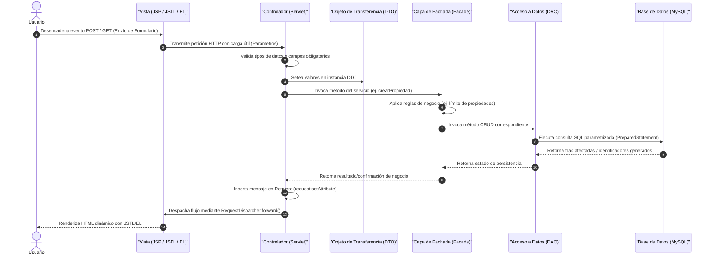
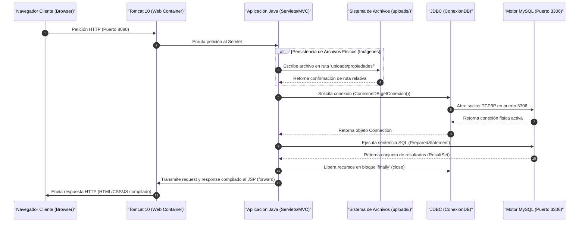

# InmobiX: Portal de Gestión y Comparación Inmobiliaria
## Proyecto de Ingeniería de Software - Arquitectura Empresarial por Capas

InmobiX es una plataforma web autogestionada diseñada bajo el estándar **Jakarta EE** que implementa el patrón arquitectónico **Modelo-Vista-Controlador (MVC)**. El sistema promueve el desacoplamiento de responsabilidades mediante capas lógicas bien definidas, garantizando alta cohesión y bajo acoplamiento para el mercado inmobiliario peruano.

---

## 🏛️ 1. Introducción y Fundamentos Arquitectónicos

El proyecto destaca por incorporar las siguientes características diferenciadoras de negocio y diseño:
*   **Jerarquía Geográfica Indexada**: Estructuración relacional de la división político-administrativa peruana (**Departamento $\rightarrow$ Provincia $\rightarrow$ Distrito**) para búsquedas geográficas de precisión.
*   **Esquema Bimonetario Transaccional**: Modelo dinámico de persistencia de tipos de cambio que permite búsquedas bimonetarias homogéneas con conversión automática de divisas en la capa de datos.
*   **Persistencia e Infraestructura Aislada**: Cero dependencia de microservicios o APIs de pago/nube de terceros, permitiendo la total autonomía de despliegue en entornos locales y académicos controlados.

---

## 🛠️ 2. Especificación del Stack y Alternativas Locales

### 2.1 Stack Tecnológico Principal
*   **Backend**: Java Jakarta EE 10, Apache Tomcat 10.x (Contenedor de Servlets), JDBC (MySQL 8.x) para persistencia sin dependencias de frameworks ORM externos.
*   **Frontend**: JSP con JSTL 3.x, Expression Language (EL) para enlace de variables, JSF (Jakarta Server Faces 4.0) para el ciclo de vida de Consultas, Tailwind CSS para estilos responsivos, JS Vanilla y Leaflet.js.

### 2.2 Estrategias de Desacoplamiento de Servicios Externos

| Servicio de Producción | Alternativa Académica Local Implementada | Mecanismo de Control / Capa |
| :--- | :--- | :--- |
| **Proveedores Identity (OAuth)** | Autenticación basada en sesiones HTTP nativas y hash criptográfico local. | Filtros de Servlet (`jakarta.servlet.Filter`) para interceptación de rutas. |
| **Google Maps / Mapbox API** | Integración de la biblioteca open-source `Leaflet.js` consumiendo mapas de OpenStreetMap. | Coordenadas decimales (latitud/longitud) almacenadas en base de datos. |
| **Pasarelas Comerciales (Culqi)** | Registro, auditoría e historial transaccional simulado en base de datos. | Códigos de operación transaccionales autogenerados aleatoriamente. |
| **Servicios de Almacenamiento (S3)**| Servidor de archivos locales en el directorio virtualizado `/uploads/propiedades/`. | Persistencia de rutas relativas limpias en DTOs. |

### 2.3 Capas de la Arquitectura MVC

| Capa Arquitectónica | Ubicación y Paquetes | Responsabilidad en el Flujo de Datos | Restricciones de Implementación |
| :--- | :--- | :--- | :--- |
| **Vista (View)** | `/src/main/webapp/WEB-INF/views/` | Interfaz gráfica y enlace declarativo mediante Expression Language (EL). | Prohibido el uso de scriptlets (`<% ... %>`). Exclusividad de JSTL. |
| **Controlador (Controller)** | `org.example.proyectoweb.controller` | Servlets que interpretan la petición HTTP (`request`), controlan sesiones e invocan servicios. | Nula comunicación directa con los DAOs. Dependencia exclusiva de Facades. |
| **Fachada (Facade)** | `org.example.proyectoweb.facade` | Orquestación transaccional y aplicación de reglas de negocio consolidadas. | Oculta la complejidad de la capa de persistencia ante los controladores. |
| **Acceso a Datos (DAO)** | `org.example.proyectoweb.dao` | Consultas CRUD parametrizadas mediante JDBC y control de transacciones. | Uso obligatorio de `PreparedStatement` para mitigar inyección de SQL. |
| **Objeto de Datos (DTO)** | `org.example.proyectoweb.dto` | Representación tipada de entidades de datos sin lógica de comportamiento. | Clases planas (POJO) con getters, setters y constructores. |

---

## 🔄 3. Flujo de Información y Diagramas del Sistema

### 3.1 Flujo del Ciclo de Vida del Request (Secuencia)
Este diagrama ilustra la transmisión de la petición del cliente y cómo es procesada a través de las capas desacopladas del patrón MVC:



### 3.2 Flujo de Normalización en el Buscador Inteligente
Esquema de normalización de cadenas de búsqueda para conciliar las sugerencias autocompletadas del cliente con el catálogo físico de la base de datos:

```mermaid
graph TD
    A["Navegador: Ingresa 'Miraflores (Lima)'"] -->|Petición GET /propiedades| B[PropiedadServlet]
    B -->|buscarPropiedadesAvanzado| C[PropiedadFacade]
    C -->|buscarPropiedades| D[PropiedadDAO]
    D -->|cleanKeyword| E["Filtro cleanKeyword: Remueve paréntesis 'Miraflores'"]
    E -->|PreparedStatement: LIKE %Miraflores%| F[(MySQL DB)]
    F -->|Registros Coincidentes| D
    D -->|Instancia DTOs + Resuelve URLs de Fotos| C
    C -->|Retorna List de DTOs| B
    B -->|Despacha a Vista (forward)| G[propiedades.jsp]
    G -->|EL: getFotoPrincipalUrl| H[Renderiza tarjetas con imágenes resueltas]
```

### 3.3 Arquitectura Física e Infraestructura del Sistema
Diagrama de secuencia físico que detalla la transferencia de información y comunicación de sockets entre los componentes de la red e infraestructura del sistema:



---

## 📁 4. Estructura Orgánica del Proyecto

La jerarquía física de archivos sigue los estándares de organización y encapsulamiento Java EE:

```text
Portal-Inmobiliario/
├── src/main/java/org/example/proyectoweb/
│   ├── bean/              # Managed Beans de JSF (ej. ConsultaBean.java)
│   ├── controller/        # Servlets de Control (ej. PropiedadServlet.java)
│   ├── dao/               # Clases de acceso a datos JDBC (ej. PropiedadDAO.java)
│   ├── dto/               # Modelos de Intercambio (ej. PropiedadDTO.java)
│   ├── facade/            # Fachadas de negocio (ej. PropiedadFacade.java)
│   └── util/              # Conexión DB y utilidades generales
├── src/main/webapp/
│   ├── WEB-INF/
│   │   ├── views/         # Vistas protegidas por seguridad
│   │   │   ├── admin/     # Consola del administrador
│   │   │   ├── agente/    # Creación/edición y panel del Agente
│   │   │   ├── layout/    # Navbar común (header.jsp)
│   │   │   ├── public/    # Catálogo público, comparador y detalles
│   │   │   └── usuario/   # Perfil y favoritos del comprador
│   │   └── web.xml        # Descriptor de Despliegue
│   ├── assets/            # Archivos estáticos (CSS, JS, logos)
│   ├── index.jsp          # Página de aterrizaje
│   ├── confirmacion.xhtml # Vista de confirmación JSF
│   └── nuevaConsulta.xhtml# Formulario de consultas JSF
├── inmobix_db.sql         # Script SQL de la Base de Datos
└── pom.xml                # Configuración de Maven
```

---

## 📋 5. Roles, Permisos y Planes Comerciales

### 5.1 Matriz de Funcionalidades por Rol
El sistema restringe el acceso de negocio a nivel de controlador mediante el uso de sesiones HTTP (`sessionScope`):

| Funcionalidad / Caso de Uso | Usuario Regular | Agente Inmobiliario | Administrador |
| :--- | :---: | :---: | :---: |
| Búsqueda, catálogo y detalles del inmueble | ✔ | ✔ | ✔ |
| Visualización cartográfica interactiva (Leaflet.js) | ✔ | ✔ | ✔ |
| Persistencia en favoritos | ✔ | ✔ | ❌ |
| Comparación técnica de fichas | ✔ | ✔ | ❌ |
| Envío de leads / Consultas directas | ✔ | ❌ | ❌ |
| Publicación y mantenimiento de catálogo propio | ❌ | ✔ | ✔ (Global) |
| Visualización de métricas y gráficos de rendimiento | ❌ | ✔ | ❌ |
| Gestión comercial (Adquisición de planes) | ❌ | ✔ | ❌ |
| Auditoría, seguridad y moderación global | ❌ | ❌ | ✔ |
| Mantenimiento de catálogos y ubicaciones | ❌ | ❌ | ✔ |

### 5.2 Planes de Publicación y Límites de Suscripción (RF-07)

| Dimensión del Plan | Plan Gratuito | Plan Básico | Plan Premium |
| :--- | :---: | :---: | :---: |
| **Costo Mensual** | S/. 0 | S/. 50 | S/. 150 |
| **Límite de Propiedades Activas**| 1 propiedad | 5 propiedades | 20 propiedades |
| **Vigencia del Anuncio** | 30 días | 60 días | Ilimitado |
| **Límite de Carga de Imágenes** | 3 fotos | 10 fotos | 30 fotos |
| **Visibilidad en Listado** | Estándar | Regular | Destacado (Badge) |
| **Acceso a Analytics** | Estadísticas básicas | Gráficos históricos | Insights avanzados |

---

## 🖼️ 6. Evidencias Gráficas Recomendadas (Capturas de Pantalla)

*Para complementar de manera visual la sustentación de este proyecto técnico, se sugiere incorporar capturas del sistema en funcionamiento:*

1.  **Página de Inicio con Buscador Inteligente**: Captura del buscador con la caja de sugerencias interactiva filtrando un distrito en tiempo real (ej. "Miraflores (Lima)").
2.  **Catálogo de Búsqueda Avanzada**: Vista del catálogo filtrando por múltiples rangos de precio bimonetarios y devolviendo las propiedades con sus portadas cargadas.
3.  **Ficha de Detalle e Integración Cartográfica**: Detalle de un inmueble mostrando la renderización interactiva del mapa de Leaflet.js y la galería de imágenes secundarias.
4.  **Comparador Técnico**: Tabla interactiva comparando dos o más inmuebles, mostrando el cálculo del precio por metro cuadrado y el sombreado cromático de diferencias.
5.  **Dashboard del Agente (Analytics)**: Visualización de las métricas de rendimiento y el gráfico de visitas histórico renderizado con Chart.js.

---

## 🚀 7. Compilación y Despliegue

### Compilar Proyecto
```bash
./mvnw.cmd compile
```

### Inicialización del Esquema Relacional
1.  Verifique el servicio MySQL local activo (puerto 3306).
2.  Ejecute `inmobix_db.sql` en su cliente de base de datos para levantar el esquema, las vistas y los datos semilla parametrizados.

### Despliegue de Aplicación
1.  Configure Apache Tomcat 10+ apuntando el directorio compilado al contexto `/proyectoweb` o raíz `/`.
2.  Inicie el servidor y acceda desde `http://localhost:8080/proyectoweb`.
