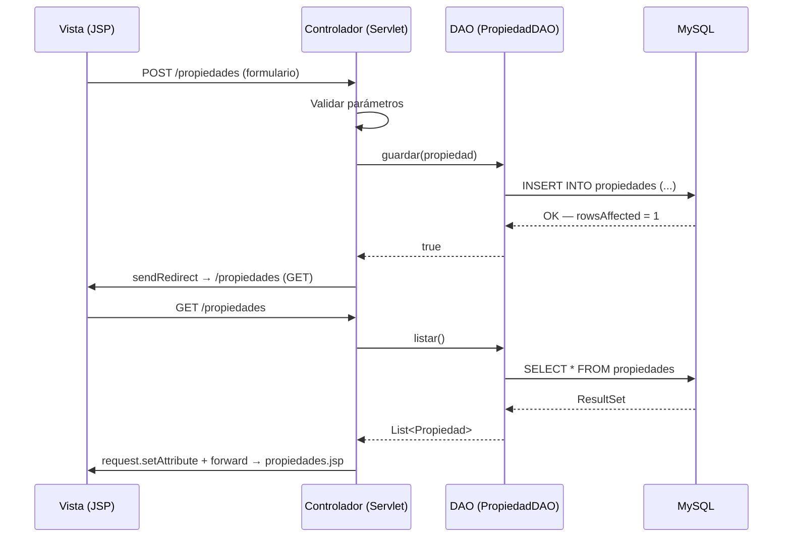

# 🏢 InmobiX — Portal Inmobiliario Peruano · Avance 01

> **InmobiX** es una plataforma web que transforma la experiencia de búsqueda, publicación y gestión de inmuebles en el Perú. Conecta compradores, arrendatarios, agentes inmobiliarios y constructoras en un ecosistema digital optimizado para la realidad del mercado local: lógica **bimonetaria (Soles / Dólares)**, segmentación por distritos y urbanizaciones, cumplimiento de la **Ley N° 29733** de Protección de Datos Personales.

---
<div align="center">
  
</div>
## 🎯 Objetivo del Avance 01

Establecer la **infraestructura base del portal** implementando el patrón **MVC + DAO** sobre Jakarta EE. Los entregables concretos de este hito son:

| # | Entregable | Criterio de Aceptación |
|---|-----------|------------------------|
| 1 | Servidor desplegado | Apache Tomcat levanta el `.war` sin excepciones |
| 2 | Servlet funcional (GET) | Lista dinámica de propiedades renderizada en JSP |
| 3 | Servlet funcional (POST) | Alta de propiedad persiste en BD y redirige al listado |
| 4 | Conexión JDBC | Inserción verificada directamente en MySQL |

---

## 💻 Stack Tecnológico

| Capa | Tecnología | Rol en la Arquitectura |
|------|-----------|------------------------|
| **Backend** | Java 17 · Jakarta EE 10 | Lógica de negocio y control de flujo HTTP |
| **Controlador** | Jakarta Servlet (`doGet` / `doPost`) | Enrutamiento, validación de parámetros y redirección |
| **Vista** | JSP · JSTL 3.x · HTML5 / CSS3 | Renderización dinámica de datos del servidor |
| **Modelo / DAO** | JDBC Puro · Patrón DAO | Acceso a datos sin ORM; encapsula sentencias SQL |
| **Base de Datos** | MySQL | Persistencia relacional de propiedades y usuarios |
| **Build / Deploy** | Maven 3.x · Apache Tomcat 10 | Compilación del proyecto y servidor web contenedor |

---

## 🏗️ Arquitectura MVC — Flujo de Datos



---

## 📁 Estructura del Proyecto

```
proyectoweb/
├── src/main/
│   ├── java/org/example/proyectoweb/
│   │   ├── controller/          # Servlets (MVC - Controlador)
│   │   ├── model/               # Entidades POJO (MVC - Modelo)
│   │   ├── dao/                 # Patrón DAO - Acceso a BD
│   │   └── util/
│   │       └── ConexionDB.java  # Pool JDBC
│   └── webapp/
│       ├── WEB-INF/
│       │   ├── web.xml          # Mapeo de Servlets
│       │   └── views/           # MVC - Vista
│       └── index.jsp
├── database.sql                 # Script DDL + datos semilla
└── pom.xml
```

---

## ⚙️ Requisitos Previos

- **JDK 17** o superior (`java -version`)
- **Apache Maven 3.8+** (`mvn -version`)
- **Apache Tomcat 10.x** instalado y variable `CATALINA_HOME` configurada
- **MySQL 8.x** corriendo en `localhost:3306`

---

## 🚀 Pasos de Ejecución (Despliegue Local)

### Paso 1 — Crear la Base de Datos

```sql
-- Ejecutar en MySQL Workbench o terminal:
CREATE DATABASE inmobix_db CHARACTER SET utf8mb4 COLLATE utf8mb4_unicode_ci;
USE inmobix_db;
SOURCE /ruta/al/proyecto/database.sql;
```

### Paso 2 — Configurar Credenciales JDBC

Edite el archivo `src/main/java/org/example/proyectoweb/util/ConexionDB.java` con sus credenciales locales:

```java
private static final String URL  = "jdbc:mysql://localhost:3306/inmobix_db";
private static final String USER = "root";       // ← su usuario MySQL
private static final String PASS = "su_password"; // ← su contraseña
```

### Paso 3 — Compilar y Empaquetar

```bash
# Desde la raíz del proyecto (donde está pom.xml)
mvn clean package
```
> El artefacto generado se encuentra en `target/proyectoweb.war`.

### Paso 4 — Desplegar en Tomcat

```bash
# Opción A — Copia manual
cp target/proyectoweb.war $CATALINA_HOME/webapps/

# Opción B — Maven Tomcat Plugin (si está configurado en pom.xml)
mvn tomcat10:deploy
```

### Paso 5 — Acceder a la Aplicación

Abra su navegador en:

```
http://localhost:8080/proyectoweb/index.jsp
```

---

## 🔑 Requerimientos Implementados en Este Avance

Este primer hito sienta las bases técnicas para los siguientes módulos funcionales del sistema:

| Código | Requerimiento | Estado |
|--------|--------------|--------|
| **RF-02** | Publicación de fichas de propiedades (campos básicos: título, precio, distrito, área) | Implementado |
| **RNF-03** | Arquitectura MVC modular con separación clara de capas | Implementado |
| **RNF-02** | Validación de parámetros en el Servlet (prevención de datos nulos) | Parcial |
| RF-01 | Gestión de usuarios y roles | Próximo avance |
| RF-03 | Motor de búsqueda y filtros bimonetarios | Próximo avance |
| RF-07 | Módulo comercial y pasarela de pagos nacionales | Próximo avance |

---

## 📸 Evidencia de Resultados

### 1 · Despliegue Exitoso en Apache Tomcat
*El servidor levanta el proyecto sin arrojar excepciones en el log de arranque.*


### 2 · Listado Dinámico — Flujo GET (Vista / Servlet)
*El Servlet `doGet` consulta el `PropiedadDAO` y proyecta los registros en `propiedades.jsp` via JSTL.*


### 3 · Alta de Propiedad — Flujo POST (Formulario → Controlador)
*Envío del formulario y posterior redirección orquestada por el Servlet.*

<br>


### 4 · Persistencia Verificada en MySQL (JDBC Puro)
*Comprobación directa en el motor de que `PropiedadDAO.guardar()` insertó la fila correctamente.*


---

## 👥 Equipo de Desarrollo

| Rol | Nombre |
|-----|--------|
| 1 | *Olivares Chavez Jeremi* |
| 2 | *Miranda Quispe Dharma* |
| 3 | *Inoñan Suarez Antonio* |
| 4 | *Betancur Penadillo Olmer* |

---

*Proyecto 2026 — Curso de Desarrollo Web Integrado *
