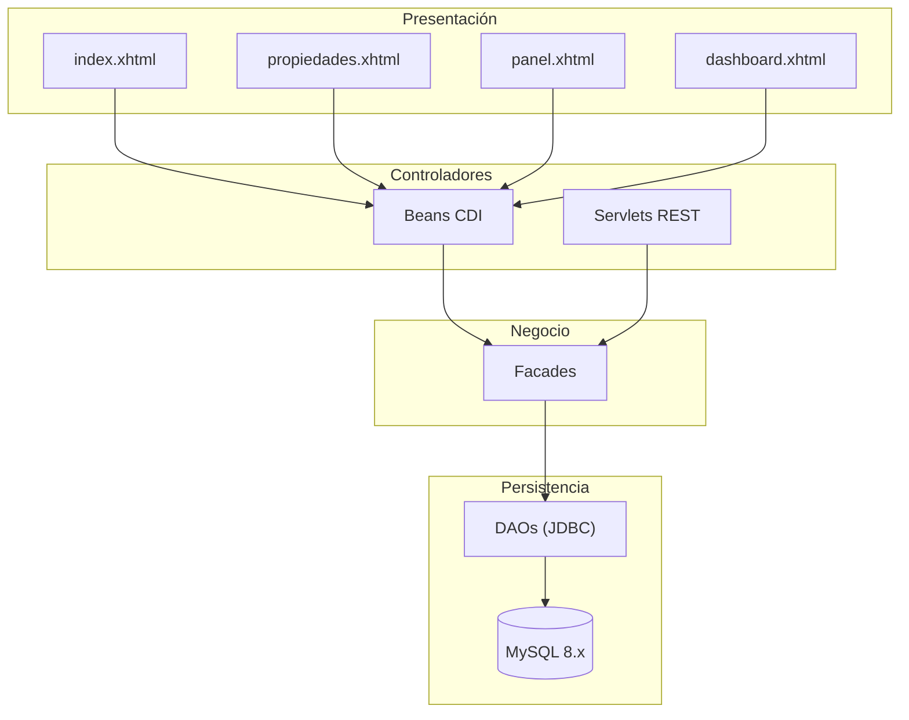
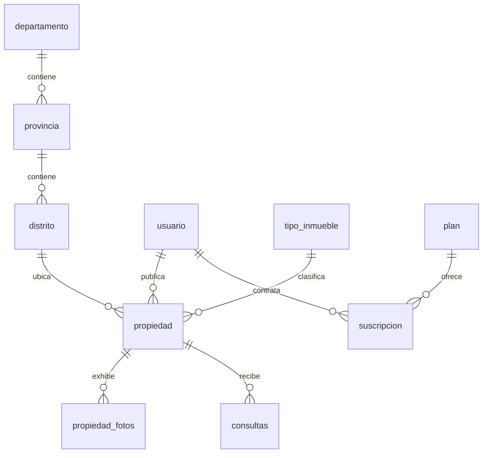
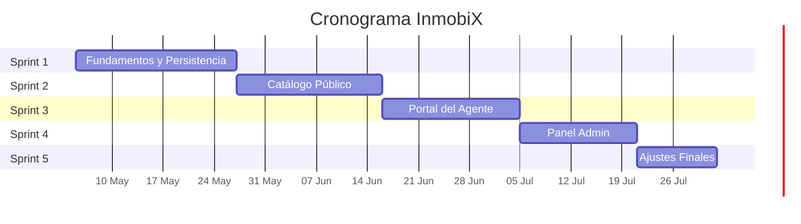
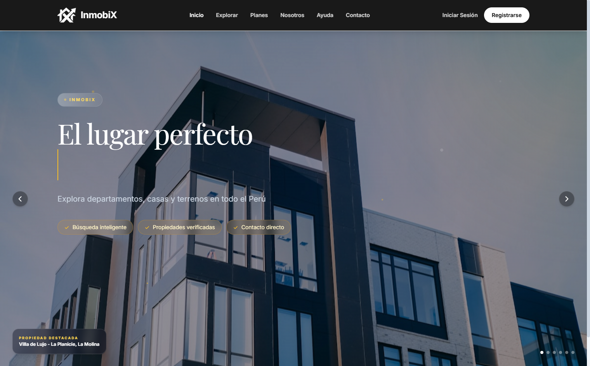
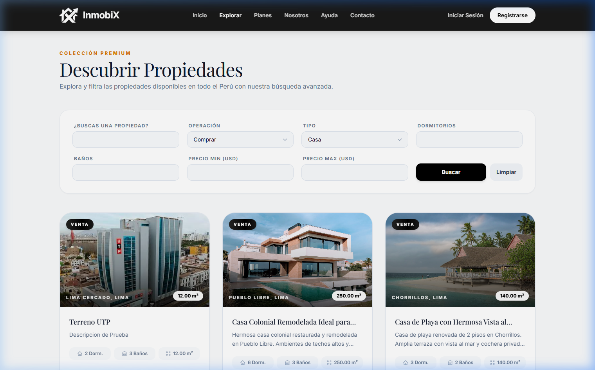
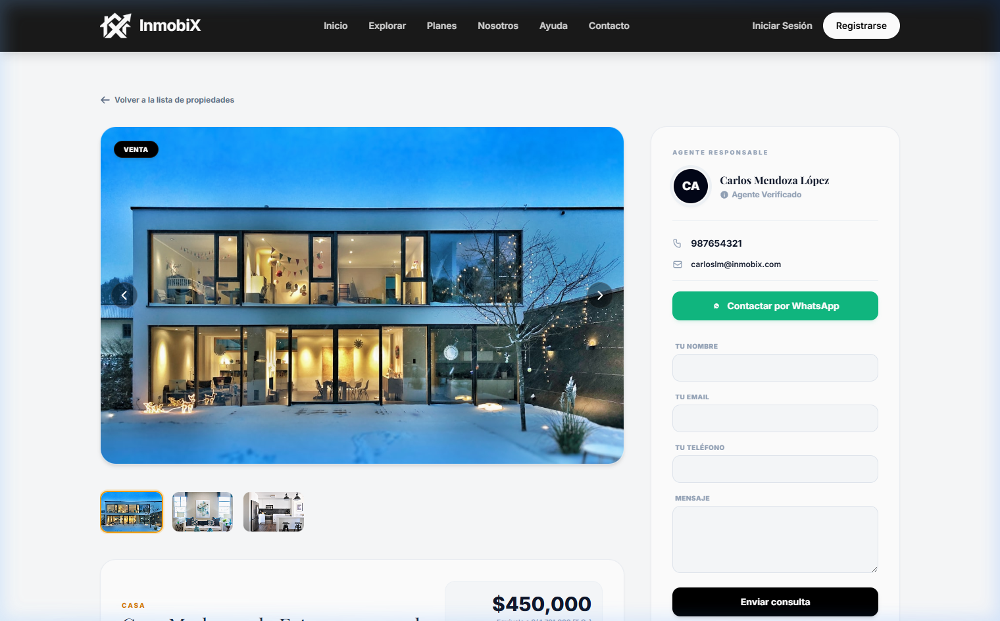
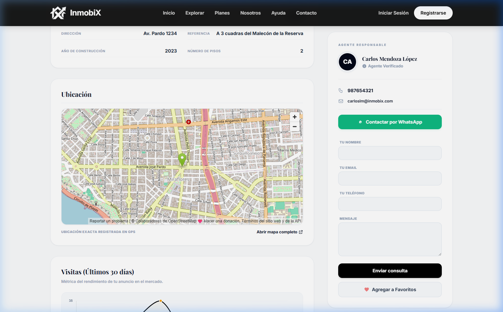
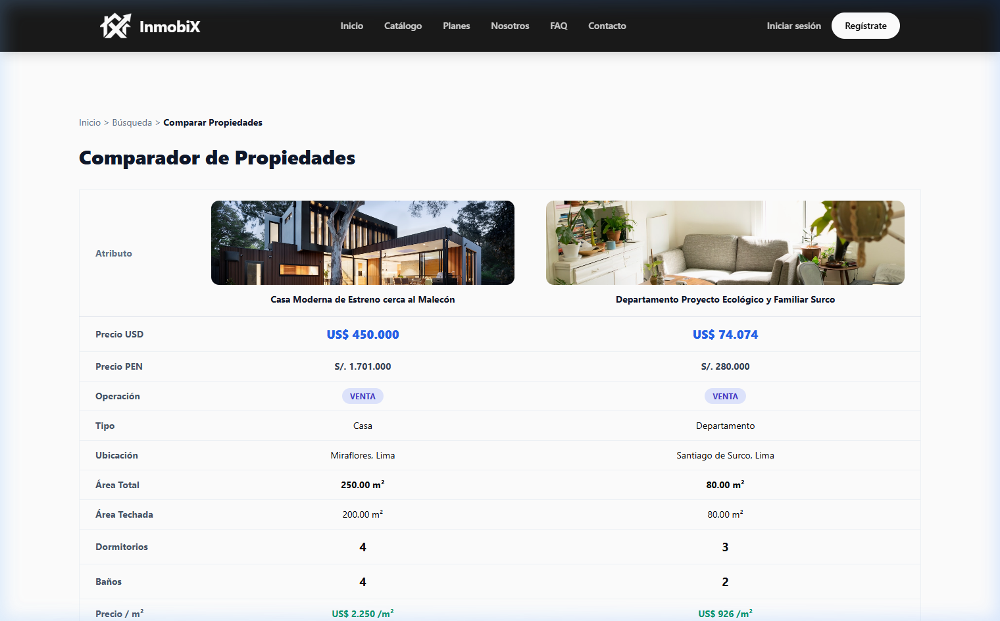
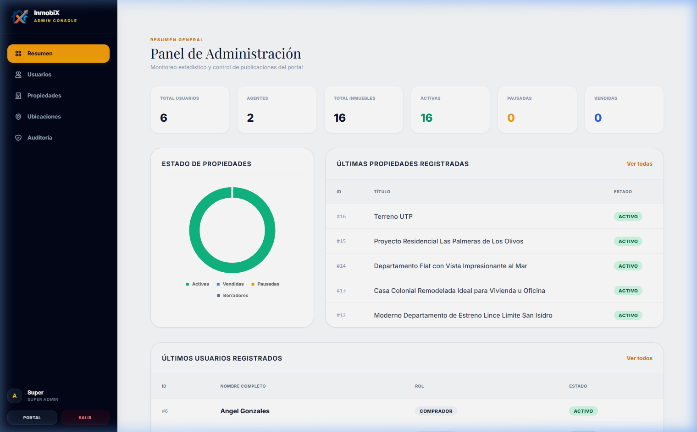

# 🏠 InmobiX — Portal Inmobiliario del Perú

> Plataforma web para la publicación, búsqueda, comparación y gestión de inmuebles en el mercado peruano.

**Institución:** Universidad Tecnológica del Perú (UTP)
**Curso:** Desarrollo de Aplicaciones Web
**Ciclo:** 2026-I

---

## 📌 Resumen

InmobiX digitaliza los procesos de comercialización inmobiliaria en Perú, integrando particularidades locales como la codificación geográfica **UBIGEO (INEI)**, conversión bimonetaria **PEN/USD** (tipo de cambio SBS), verificación de partidas registrales SUNARP y programas de vivienda (**MiVivienda**, **Bono Verde**).

## 🧰 Stack Tecnológico

| Componente | Tecnología |
| :--- | :--- |
| Lenguaje | Java 17 (LTS) |
| Especificación | Jakarta EE 10 |
| Vistas | JSF 4.0 (Mojarra) + Facelets |
| CDI | Weld Servlet Core 6.0.3 |
| API REST | Jersey 4.0.0 + Jackson |
| Servidor | Apache Tomcat 10.1.x |
| Base de datos | MySQL 8.x |
| Seguridad | jBCrypt 0.4 |
| Build | Apache Maven (Maven Wrapper) |
| Estilos | Tailwind CSS |
| Mapas | Leaflet.js + OpenStreetMap |
| Gráficos | Chart.js |

## 🏗️ Arquitectura por Capas



## 🗂️ Modelo de Datos (resumen)

17 tablas relacionadas: geografía (departamento → provincia → distrito, UBIGEO), usuarios y roles, propiedades, galería, consultas, contactos WhatsApp, planes/suscripciones, pagos, estadísticas y auditoría. Incluye la vista `v_propiedades_bimonetarias` (cálculo automático PEN/USD).



## 📅 Cronograma (5 Sprints)



## 👥 Roles y Permisos

| Funcionalidad | Visitante | Comprador | Agente | Constructora | Admin |
| :--- | :---: | :---: | :---: | :---: | :---: |
| Buscar propiedades | ✔ | ✔ | ✔ | ✔ | ✔ |
| Comparar inmuebles | ✔ | ✔ | ✔ | ✔ | — |
| Guardar favoritos | — | ✔ | ✔ | ✔ | — |
| Enviar consultas | ✔ | ✔ | — | — | — |
| Publicar propiedades | — | — | ✔ | ✔ | ✔ |
| Ver estadísticas | — | — | ✔ | ✔ | — |
| Gestionar usuarios | — | — | — | — | ✔ |
| Moderar propiedades | — | — | — | — | ✔ |

## ✅ Requerimientos Clave

| Código | Descripción | Prioridad |
| :--- | :--- | :---: |
| RF-01 | Registro de usuarios con roles | Alta |
| RF-03 | Publicación de propiedades por agentes | Alta |
| RF-04 | Catálogo con buscador y filtros | Alta |
| RF-06 | Comparador (hasta 3 propiedades) | Media |
| RF-09 | Panel admin (usuarios, propiedades, ubicaciones, auditoría) | Alta |
| RF-12 | Conversión bimonetaria PEN/USD | Alta |

## 🖼️ Evidencias Visuales

| Vista | Descripción |
| :--- | :--- |
|  | Página de inicio con buscador inteligente |
|  | Catálogo con filtros avanzados |
|  | Detalle del inmueble — galería y ficha técnica |
|  | Detalle del inmueble — mapa Leaflet.js |
|  | Comparador de inmuebles |
|  | Dashboard del agente (Chart.js) |
|  | Panel de administración |

> ⚠️ Las imágenes deben ubicarse en una carpeta `capturas/` junto a este README para que se muestren correctamente en GitHub/GitLab.

## 🚀 Instalación y Despliegue

**Prerrequisitos:** JDK 17+, MySQL 8.x (puerto 3306). No requiere instalar Maven ni Tomcat (incluye Maven Wrapper + plugin Cargo).

```bash
# 1. Crear base de datos
mysql -u root -p < inmobix_db.sql

# 2. Compilar y empaquetar
.\mvnw.cmd clean package -DskipTests

# 3. Desplegar con Cargo
.\mvnw.cmd cargo:run -DskipTests

# 4. Acceder
http://localhost:8080/
```

## 🔑 Credenciales de Prueba

| Rol | Correo | Contraseña |
| :--- | :--- | :--- |
| Administrador | admin@inmobix.pe | 123456 |
| Agente | agente@inmobix.com | 123456 |
| Comprador | comprador@inmobix.pe | 123456 |

## 📝 Conclusiones

- Arquitectura MVC por capas → mantenibilidad y bajo acoplamiento.
- Validaciones en la Facade → integridad de datos.
- BCrypt + PreparedStatement + roles → seguridad adecuada.
- Integración Leaflet.js/Chart.js con JSF 4.0 → viable y productiva.
- Metodología ágil por sprints → gestión progresiva de la complejidad.

## 🔮 Recomendaciones Futuras

- Filtro de servlet para proteger rutas `/agente/*` y `/admin/*`.
- Almacenamiento de imágenes en la nube (S3/GCS).
- Pool de conexiones (HikariCP) en vez de `DriverManager`.
- Pruebas automatizadas (JUnit 5, Selenium/Arquillian).
- Pasarelas de pago peruanas (Culqi, Niubiz, Izipay).
- Notificaciones en tiempo real vía WebSocket.

## 📚 Referencias

- Jakarta EE 10 / JSF 4.0 — jakarta.ee
- Apache Tomcat 10.1 — tomcat.apache.org
- MySQL 8.0 Reference Manual — dev.mysql.com
- Leaflet.js — leafletjs.com
- Chart.js — chartjs.org
- Tailwind CSS — tailwindcss.com
- OWASP Top Ten — owasp.org
- INEI (UBIGEO) — inei.gob.pe
- SBS (Tipo de cambio) — sbs.gob.pe
