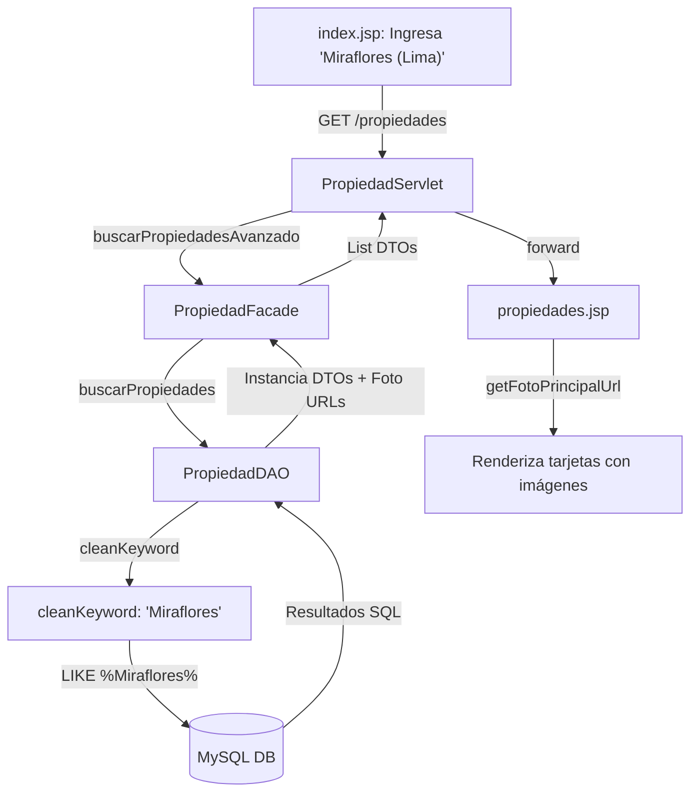

# InmobiX - Portal Inmobiliario Premium (Proyecto Académico)

Plataforma web académica para conectar compradores con agentes inmobiliarios, diseñada con patrón **MVC** en **Java EE / Jakarta EE**.

---

## 🏛️ 1. Resumen & Arquitectura

### 1.1 Stack Tecnológico & Alternativas Académicas
*   **Backend**: Java Jakarta EE 10, Apache Tomcat 10.x, JDBC (MySQL 8.x).
*   **Frontend**: JSP con JSTL 3.x, Expression Language (EL), JSF (Consultas), Tailwind CSS, JS Vanilla y Leaflet.js (mapas gratuitos sin API keys).

| Servicio Restringido | Solución Local / Académica |
| :--- | :--- |
| **OAuth** | Autenticación con hash local de contraseñas |
| **Google Maps** | `Leaflet.js` + `OpenStreetMap` (totalmente gratuito) |
| **Pasarelas de Pago** | Simulación de transacciones y estados en BD |
| **Mensajería** | Notificaciones internas persistidas en MySQL |
| **Cloud Storage** | Directorio físico local `uploads/propiedades/` |

---

### 1.2 Capas MVC
| Capa | Paquete / Ruta | Responsabilidad |
| :--- | :--- | :--- |
| **Vista** | `src/main/webapp/WEB-INF/views/` | Renderizado dinámico con JSTL/EL. Cero scriptlets. |
| **Controlador** | `org.example.proyectoweb.controller` | Gestión de peticiones HTTP, sesión y redirecciones. |
| **Fachada** | `org.example.proyectoweb.facade` | Orquestador de DAOs y lógica de negocio. |
| **DAO** | `org.example.proyectoweb.dao` | Operaciones CRUD y consultas seguras (PreparedStatements). |
| **DTO** | `org.example.proyectoweb.dto` | Modelos de intercambio de datos. |

---

## 🔄 2. Flujo del Sistema (Diagramas)

### 2.1 Flujo de una Operación (Secuencia)
```mermaid
sequenceDiagram
    autonumber
    actor Usuario
    participant JSP as "Vista (JSP / JSTL / EL)"
    participant Servlet as "Controlador (Servlet)"
    participant DTO as "Objeto de Transferencia (DTO)"
    participant Facade as "Capa de Mediación (Facade)"
    participant DAO as "Acceso a Datos (DAO)"
    database DB as "Base de Datos (MySQL)"

    Usuario->>JSP: Envía formulario (POST/GET)
    JSP->>Servlet: Petición HTTP
    Servlet->>Servlet: Valida campos y formatos
    Servlet->>DTO: Setea valores en DTO
    Servlet->>Facade: Invoca negocio (crearPropiedad)
    Facade->>Facade: Valida reglas (precios, límites)
    Facade->>DAO: Invoca CRUD (crear)
    DAO->>DB: Ejecuta PreparedStatement
    DB-->>DAO: Filas afectadas / ID
    DAO-->>Facade: Retorna estado
    Facade-->>Servlet: Retorna confirmación
    Servlet->>Servlet: request.setAttribute("mensaje", ...)
    Servlet->>JSP: RequestDispatcher.forward()
    JSP-->>Usuario: Muestra interfaz actualizada
```

### 2.2 Flujo de Búsqueda Inteligente y Autocompletado


---

## 📁 3. Estructura del Proyecto

```text
Portal-Inmobiliario/
├── src/main/java/org/example/proyectoweb/
│   ├── bean/              # Managed Beans de JSF (ej. ConsultaBean.java)
│   ├── controller/        # Servlets de Control (ej. PropiedadServlet.java)
│   ├── dao/               # Clases de acceso a datos JDBC (ej. PropiedadDAO.java)
│   ├── dto/               # Modelos de Intercambio (ej. PropiedadDTO.java)
│   ├── facade/            # Fachadas de negocio (ej. PropiedadFacade.java)
│   └── util/              # Conexión DB y utilidades generales
├── src/main/webapp/
│   ├── WEB-INF/
│   │   ├── views/         # Vistas protegidas por seguridad
│   │   │   ├── admin/     # Consola del administrador
│   │   │   ├── agente/    # Creación/edición y panel del Agente
│   │   │   ├── layout/    # Navbar común (header.jsp)
│   │   │   ├── public/    # Catálogo público, comparador y detalles
│   │   │   └── usuario/   # Perfil y favoritos del comprador
│   │   └── web.xml        # Descriptor de Despliegue
│   ├── assets/            # Archivos estáticos (CSS, JS, logos)
│   ├── index.jsp          # Página de aterrizaje
│   ├── confirmacion.xhtml # Vista de confirmación JSF
│   └── nuevaConsulta.xhtml# Formulario de consultas JSF
├── inmobix_db.sql         # Script SQL de la Base de Datos
└── pom.xml                # Configuración de Maven
```

---

## 📋 4. Roles, Permisos y Planes

### 4.1 Matriz de Funcionalidades por Rol
| Funcionalidad | Usuario Regular | Agente Inmobiliario | Administrador |
| :--- | :---: | :---: | :---: |
| Buscar propiedades / Catálogo | ✔️ | ✔️ | ✔️ |
| Ver detalles con mapa Leaflet.js | ✔️ | ✔️ | ✔️ |
| Guardar favoritos | ✔️ | ✔️ | ❌ |
| Comparar inmuebles | ✔️ | ✔️ | ❌ |
| Enviar consultas a agentes | ✔️ | ❌ | ❌ |
| Publicar / Editar sus propiedades | ❌ | ✔️ | ✔️ (Todas) |
| Ver analytics y gráficos de vistas | ❌ | ✔️ | ❌ |
| Comprar / Upgrade de planes de pago | ❌ | ✔️ | ❌ |
| Moderar publicaciones y usuarios | ❌ | ❌ | ✔️ |
| Gestionar ubicaciones en BD | ❌ | ❌ | ✔️ |

### 4.2 Planes de Publicación (RF-07)
| Plan | Costo | Límite Propiedades | Límite Fotos | Características |
| :--- | :---: | :---: | :---: | :--- |
| **Gratuito** | S/. 0 | 1 activa | 3 fotos | Estadísticas básicas |
| **Básico** | S/. 50/mes | 5 activas | 10 fotos | Gráficos e informes de vistas |
| **Premium** | S/. 150/mes | 20 activas | 30 fotos | Destacado, videos e insights avanzados |

---

## 🚀 5. Compilación y Despliegue

### Compilar Proyecto
```bash
./mvnw.cmd compile
```

### Base de Datos
1.  Correr MySQL (puerto 3306).
2.  Importar `inmobix_db.sql` para crear tablas, vistas y cargar datos semilla.

### Despliegue
1.  Desplegar el WAR generado en **Tomcat 10+** (Contexto: `/proyectoweb` o `/`).
2.  Acceder en `http://localhost:8080/proyectoweb`.
