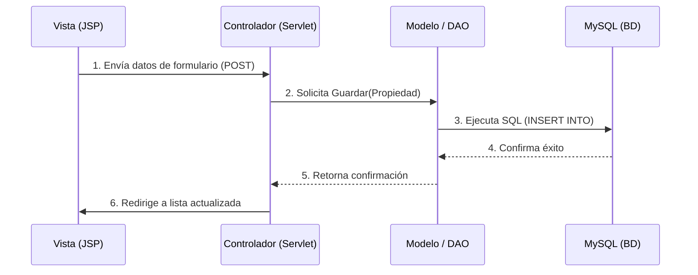

# 🏢 Portal Inmobiliario "Inmobix" - Avance 01

## 🎯 Objetivo de la Evaluación
Validar e implementar la arquitectura **MVC (Modelo-Vista-Controlador)** junto al patrón **DAO** como cimiento del portal. El sistema garantiza el enrutamiento exitoso con base en verbos HTTP (GET/POST), el listado dinámico de datos y la persistencia segura en base de datos.

## 💻 Stack Tecnológico
| Capa | Tecnología | Desempeño en Arquitectura |
| :--- | :--- | :--- |
| **Backend** | Java 17, Jakarta EE 10 | Procesamiento lógico manejado íntegramente por `Servlets`. |
| **Frontend** | JSP, JSTL 3.x, HTML | Renderización dinámica de datos extraídos del controlador. |
| **Persistencia** | MySQL 8.x, JDBC Puro | Diseño de Modelo y `DAO` libre de ORMs. |
| **Infraestructura** | Maven, Apache Tomcat | Compilación y despliegue del proyecto (`.war`). |

## ⚙️ Flujo de Datos (Arquitectura)

## 🚀 Despliegue Rápido (Local)
1. **Base de Datos:** Importe el script `database.sql` en su servidor MySQL. Confirme que las credenciales coinciden dentro del archivo fuente `ConexionDB.java`.
2. **Empaquetado:** Ejecute el comando estándar `mvn clean package` para compilar todo el árbol de dependencias del `pom.xml`.
3. **Servidor Web:** Deposite el compilado resultante en un contenedor **Apache Tomcat** (v10 o superior) e ingrese vía web a `http://localhost:8080/proyectoweb/index.jsp`.

---

## 📸 Evidencia de Resultados Estrictos (Rúbrica)

**1. Despliegue Exitoso en Apache Tomcat**  
*Evidencia del servidor y el proyecto arrancando sin arrojar excepciones.*

**2. Listado Dinámico MVC (Vista / Servlet)**  
*Prueba directa de comunicación `doGet` proyectando registros preexistentes.*

**3. Flujo POST (Alta de Registro e Intercepción)**  
*Evidencia del envío de un formulario de propiedad y el posterior redireccionamiento orquestado por el controlador.*

**4. Persistencia en Base de Datos (JDBC Puro)**  
*Verificación en el motor MySQL de que los métodos invocados en el `PropiedadDAO` insertaron físicamente las filas requeridas.*

